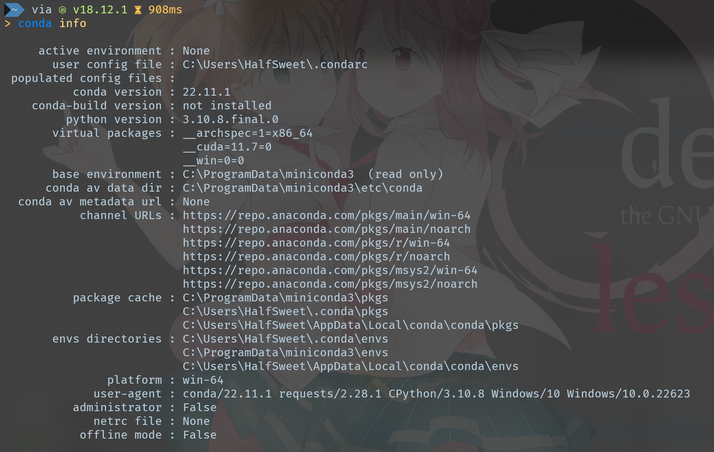
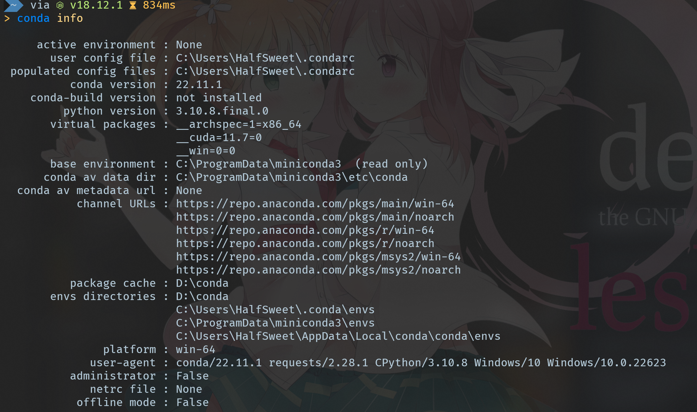
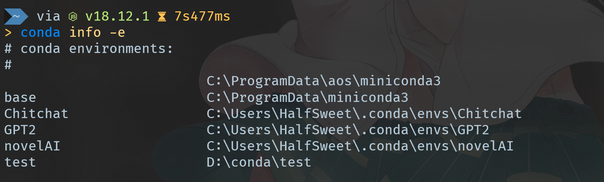

 
最近闲的没事，找了些好玩的深度学习方面的项目跑跑，但是这些项目一般采用Python进行搭建，为了不让本机的Python环境变乱，我们一般使用conda进行管理。但是，conda的环境目录默认保存在`%USERNAME%/.conda`目录下，随着使用的环境和包增多，占用了大量的C盘空间。那我们怎么才能在不重新配置的情况下将这些环境迁移到别的盘符呢。
<!-- more -->

## 查看默认的虚拟环境配置目录
我们在命令行中输入
```cmd
conda info
```
查看到默认的虚拟环境和包的存放路径均在`%USERNAME%/.conda`目录下。


## 新建虚拟环境和包的目录配置
```cmd
conda config --add envs_dirs new_dirs_name
```

```cmd
conda config --add pkgs_dirs new_pkgs_name
```
这里我们新建在`D:\conda\`目录下。

重新执行`conda info`命令，发现出现了一个用户配置文件，默认存放在`%USERNAME%`目录下，同时虚拟环境和包已经默认切换到了`D:\conda\`目录下。



## 尝试创建新的环境
```cmd
conda create -n test
```
等待执行成功之后
```cmd
conda info -e
```

发现新建的环境已经切换到了`D:\conda\`目录下。

## 迁移之前的环境（以下方式任选其一）
### 直接使用create的clone参数
直接进行克隆，我们采用之前的`novelAI`环境进行示例
```cmd
conda create -p  D:\conda\envs\novelAI\ --clone  C:\Users\HalfSweet\.conda\envs\novelAI\
```
注意，，接`-p`参数的是新的环境，也就是我们之前添加的那个；而`--clone`参数后方的则是原环境。

等待命令执行完毕后，我们通过
```cmd
conda info -e
```
命令查看，发现有两个同名的环境，通过
```cmd
conda remove -p C:\Users\HalfSweet\.conda\envs\novelAI\ --all
```
命令删除之前原目录的环境即可完成迁移。

### 使用conda pack
#### 0x01 安装conda pack
```cmd
conda install conda-pack
```
#### 0x02 将原环境进行打包
```cmd
conda pack -n envs_name
```
这里的envs_name替换为你想要迁移的环境的名称。打包完成后，将会在原目录下生成一个`envs_name.tar.gz`的文件。
#### 0x03 更新新环境
将生成的`envs_name.tar.gz`文件移动到新的环境目录下，解压成文件夹即可。使用`conda info -e`命令查看，发现已经出现了这个环境。
#### 0x04 删除原环境
```cmd
conda remove -p 原环境的目录 --all
```