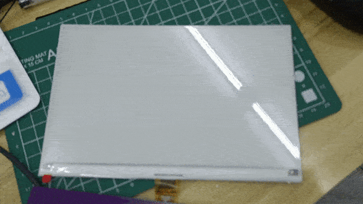
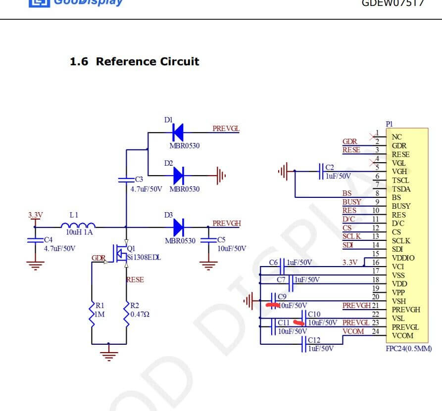
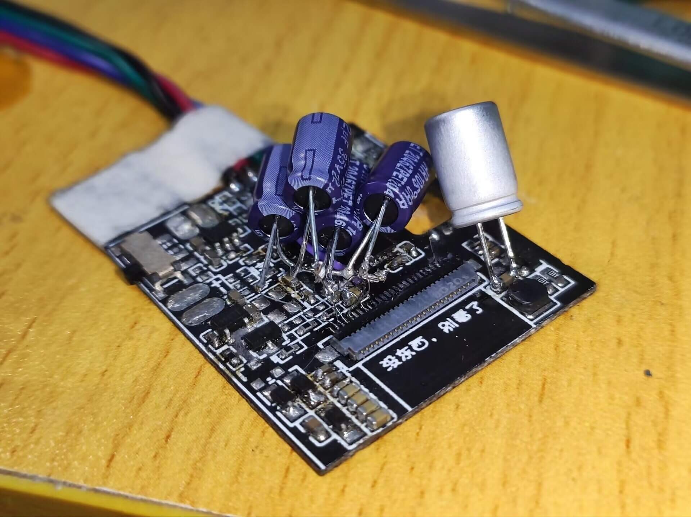
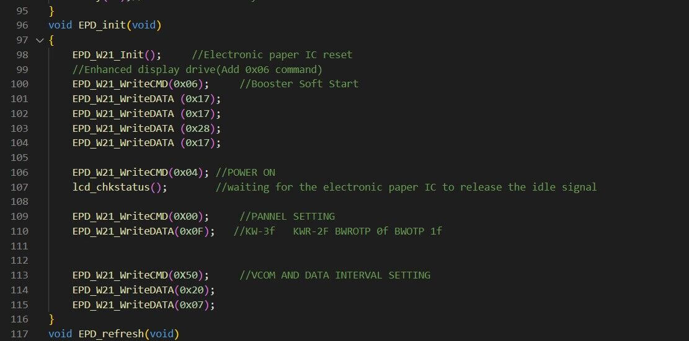
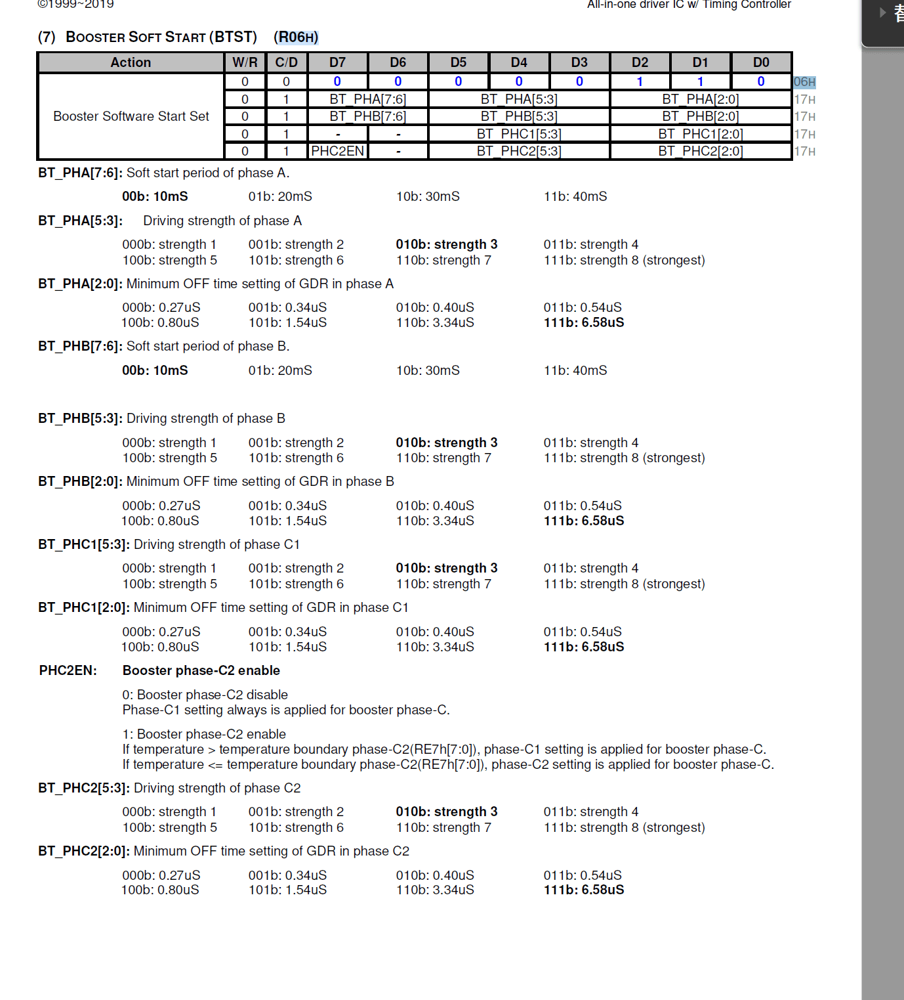
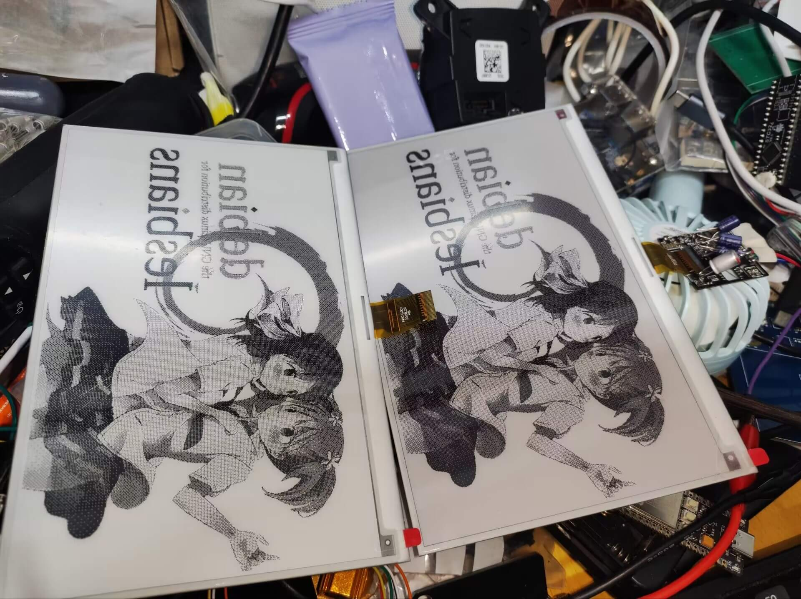

## 前言
之前在我群里的同学应该都还记得，之前有朋友送给半糖两块7.5寸的墨水屏，其中一块是黑白双色的，标签型号是DEPG0750RWU790F30，驱动芯片则是UC8179。这块屏确实蛮好的，有着高达800*480的分辨率，并且因为是7.5寸所以可视面积非常大，但是在调试的过程中半糖发现了一个问题：这个屏幕的刷新过程中怎么会出现白色条纹，并且刷完的颜色非常怪？

其中上面一张图为我自己做的波形，第二张为使用的OTP波形，但是无一例外，都出现了刷新的问题。抱着也许是驱动板出问题了的想法，我重新lay了一次板子，焊接好之后发现问题确实有所改善，但是并不佳。后续在更换过程中发现采用cd32封装的68uH的电感刷新效果会更好一些，但是依旧存在刷新问题，特别是在UI中有竖着的线条的时候，特别影响观感。

## 大佬相助
时间过得飞快，到了前几天，想着我解决不了这个问题就拉帮手的想法，我将这块屏寄给了[滚筒洗衣机](https://github.com/axdz007)大佬，然后在我的~~威逼利诱~~强烈要求下，我们开始了新一轮的测试。

果不其然，在他移植了我之前写的程序的时候，问题便复现了。
<iframe height=1280 width=720 src="/EpdTraps1/Refresh3.mp4"></iframe>
经过一系列的检查，排除了是取模方式等的因素，我们惊讶地发现…大连佳显的官方例程里面给的图片可以完美显示？紧接着我们又试了下全0xAA以及0x55的数据，理论上这样推上去的图像将是完整的一条条1像素的黑白条纹，结果……非常完美。既然横条没问题，那么竖条呢？出现了一点小问题。那么棋盘格呢？问题大了，屏幕甚至想要拒绝刷新。紧接着尝试了别的图像，结果出现了非常奇怪的效果，如果黑色比较少，分得比较开，那么刷出来没有任何问题，但是刷图片类似的比较复杂的形状又会炸掉。难道是内存出现了什么毛病？

紧接着检查，发现了一个我们之前忽视的点，硬件驱动电路！

可以看出，与常规的墨水屏驱动电路相比，该电路的高压部分电容均为10uF，并且boost电荷泵部分的电容为4.7uF，会是这个原因吗？于是大佬开始了他的飞线操作。

不得不说大佬技艺高超，很快就把缺失的电容补上了，那么，工作正常了吗？

事实证明还是有所效果，刷图的质量明显好了不少，像素棋盘格也能正常显示了，这下刷图片总没有问题了吧？

没有意外的话现在就要出意外了，令人惊讶的是棋盘格能显示，但是刷的图片还是依旧炸裂。这就奇了怪了，刷全白正常，刷全黑正常，刷条纹正常，甚至刷棋盘格也正常，但是刷区区一张图片竟然出现了问题？难道是芯片设计的bug吗。

## 初寻端倪

### TCON SETTING
经过了一系列的尝试，我们将重心转移到了寄存器的配置上。首先我注意到了一个0x60的寄存器，这个寄存器的描述为“TCON SETTING”，内容为“This command defines non-overlap period of Gate and Source.”是因为内部的时序问题才导致的刷新不正常吗？但是在修改之后未果，故障依旧。同时参考了同芯片的微雪的屏幕驱动代码，该寄存器的设置的值并不一致，但是修改后故障依旧。

### 修改PLL
我们联想到，如果是时序导致的出错，那么降低频率是否会好一些？于是我们便尝试了修改屏幕的PLL参数，该寄存器地址为0x30。神奇的事发生了，在大佬降低PLL到5Hz之后，发现之前刷新炸掉的图片竟然能正常刷新了！除了刷的很慢之外并没有什么多余的问题。紧接着又尝试了4灰度使用内部OTP波形进行刷新，发现依然能正常刷新。

难道是因为屏幕厂商的内部布线问题，导致时钟开太高会有干扰？想想便感觉非常不合理，还是说难道屏厂在测试的时候使用的都是比较简单的图片，因此并没有发现刷新的问题？不管什么样的解释，显得都非常牵强，但是目前我们也找不到更好的解决方案，因此便告一段落，并一致认为大概率是屏厂设计导致的硬件问题。

### 真凶在此
在闲聊中，我们发现威锋有一款5.83寸的屏幕与这块屏幕采用了同款驱动芯片，于是大佬便决定把5.83屏幕的初始化代码搬过来试试。令人意想不到的情况出现了，竟然……好了？在这样的初始化代码下，屏幕的刷新竟然无比的丝滑顺畅，似乎本该如此，可是，为什么呢？

幸而5.83屏的初始化代码非常简洁，我们很轻易就可以发现不同点：主要便是0x06这个寄存器。

那么，这个寄存器是做什么用的呢？

虽然描述寥寥，但是我们依稀能看出是与boost升压有关，并且第三个数据默认值为0x17，而5.83屏幕的初始化代码中为0x28，是否就是中国寄存器导致的呢？我们将这段初始化代码复制了过去。

意想不到的事出现了，正常了，彻底正常了！没有讨厌的条纹，没有刷新后掉色，屏幕安安静静刷新出一帧的画面，自然又好看。

虽然我找了下相同芯片的在GxEpd2库下方的代码，发现或多或少都对中国寄存器进行了配置，有`0x17,0x17,0x28`的，有`0xC7,0xCC,0x28`的，还有`0x17,0x17,0x39,0x17`的，大家都没有采用默认的四个0x17的值。不知道大佬佳显是抱着怎样的想法，漏掉了中国至关重要的寄存器，也许是屏厂给的测试代码就没有。

这个寄存器没有具体的描述，在SSD芯片中也有类似的寄存器，但是同样额米有具体的文字描述，根据名字来看，或许和boost有关，并且不同的值应该与驱动能力有关，但是具体有什么用，ABC相有什么区别，我不得而知，如果有知道的同学可以告诉我，不胜感激（）

## 总结
总而言之，经过了一晚上的忙活，查找了各种原因，结果发现是一个寄存器没有配置。虽然问题不大，但是蛮折磨人的，并且也不知道是具体原因。不过有了这次的经验，在下次遇到类似的故障的时候，想必找到问题出现的原因会更加轻松。

## 备注
DEPG0750RWU790F30这块屏幕请记住，一定要配置0x06的寄存器！！！相同尺寸的相同驱动芯片的屏幕应该也大致如此，希望能帮到更多遇到类似问题的同学。