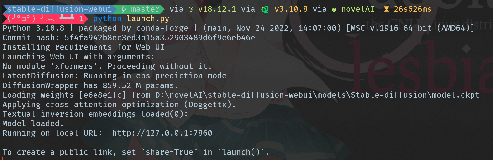
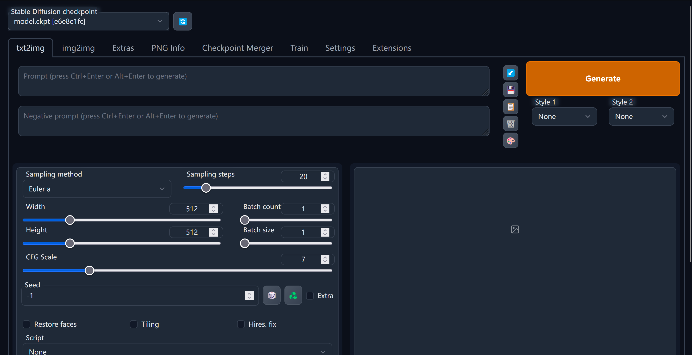
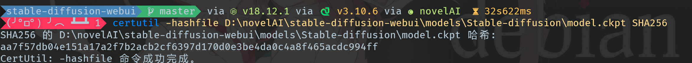
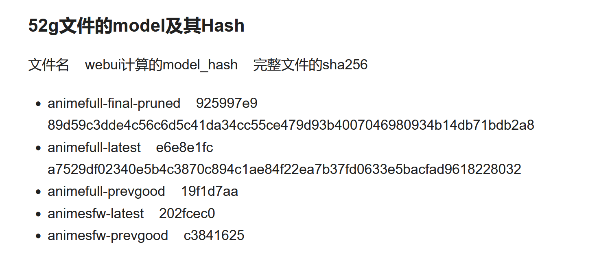
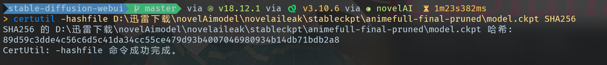

最近大家应该都玩过novelAI了，出来的图片质量都非常棒，但是b站大佬给的配置只是打包了的bat文件，但是这显然不符合我们的折腾精神，于是我们来尝试使用conda来进行纯手工配置。
<!-- more -->

## 前置条件
* git
* conda（在win上使用miniconda或者anconda均可，建议使用miniconda，体积更小）
* nvida的cuda驱动
* 合适的磁力链接下载软件
* 适当的访问外网方式，您可能需要配置命令行、conda等工具，以及您可能需要对pip/conda等工具进行换源，在此不多赘述。

## 安装stable-diffusion-webui
[stable-diffusion-webui](https://github.com/AUTOMATIC1111/stable-diffusion-webui)是一个基于用于稳定扩散的 Gradio 库的浏览器界面，作用是将泄露出来的novelAI模型以一个可视化比较好的方式进行训练与导出。

这里我们采用git clone的方式来进行下载，同时也更方便我们后期的升级等操作。在命令行中输入
```cmd
git clone https://github.com/AUTOMATIC1111/stable-diffusion-webui.git
```
等待自动克隆完毕，在此期间可以进行下一步或者做你喜欢的事。

## 下载泄露版的novelAI模型
您可以选择合适的磁力链接下载工具，下载如下的文件
```
magnet:?xt=urn:btih:LPPEILNIMJS3M4FD4XVDCY5PVUWG7DWM&dn=novelaileak&xl=55901742348
```
注意，您不需要下载全部的文件，您只需要下载`stableckpt`文件夹中的以`-final-pruned`后缀或者`-latest`后缀的文件即可。以下是各个后缀的解释：
* animefull 完整版
* animesfw 全年龄版（去除掉了某些奇怪的东西）
* -latest 最新的版本，也就是常说的7G版，请注意，这可能需要消耗更多的显存
* -final-pruned 最终裁剪版，也就是常说的4G版
* -prevgood 之前较好的版本，一般不使用


请选择一个或者多个您喜欢的模型下载，如果您对不同的模型区别有疑问，可以参考这个[链接](https://www.bilibili.com/read/cv19099066)。

在下载的过程中，您可以选择等待或者是做您喜欢的事。

## 创建一个conda虚拟环境
运行如下命令来创建一个conda的虚拟环境，注意python版本需要为3.10.6以上
```cmd
conda create -n name python=3.10
```

`-n`参数后面的`name`替换为为您想创建的虚拟环境的名称，在这里我使用了`novelAI`，之后的命令中将使用这个名称，如果您使用了别的名称，请注意自行替换。

激活环境，使用
```cmd
conda activate novelAI
```
或者直接使用
```cmd
activate novelAI
```

## 安装PyTorch

无需手动安装，接下来的安装依赖的环节会自动安装合适版本的PyTorch，手动安装可能会出现版本不兼容问题。

~~在这里，我们安装CUDA版的Pytorch，以便于获得更快的出图速度。如果您没有安装CUDA的驱动，请您自行安装以进行下一步。~~

~~前往[PyTorch官网](https://pytorch.org/get-started/previous-versions/)，查找适合您电脑CUDA驱动的版本（您可以通过命令`nvcc -v`查看当前电脑的CUDA驱动版本，并安装低于CUDA版本的PyTorch）。在这里，我们安装1.12.1版本，使用CUDA 11.6的PyTorch（使用别的版本请自行替换命令）。~~

~~conda install pytorch==1.12.1 torchvision==0.13.1 torchaudio==0.12.1 cudatoolkit=11.6 -c pytorch -c conda-forge~~

~~等待PyTorch安装完成，并查看stable-diffusion-webui是否已经完成克隆。如果没有，请坐和放宽，等待克隆完成进行下一步的依赖安装操作。~~

## 安装stable-diffusion-webui依赖
切换到克隆好的stable-diffusion-webui文件夹下
```cmd
cd stable-diffusion-webui
```
运行命令
```cmd
pip install -r requirements.txt
```
等待自动安装相关的依赖。在这段时间您可以将刚才下载好的模型的`ckpt`和`yaml`文件移到`stable-diffusion-webui\models\Stable-diffusion`文件夹下，并将同一个模型的`ckpt`和`yaml`文件修改为相同的名字。

等待pip命令执行完毕之后，运行命令
```cmd
python launch.py
```
将会自动安装模型中所需的别的依赖。这段过程可能有些漫长，但是请您耐心等待。

等待命令执行完毕，见到如下输出即代表配置完成

按照提示打开`http://127.0.0.1:7860`，即可使用。



## FAQ
### 报错"!!!! The file is most likely corrupted !!!!"
完整报错日志如下：
```
Python 3.10.6 | packaged by conda-forge | (main, Oct 24 2022, 16:02:16) [MSC v.1916 64 bit (AMD64)]
Commit hash: 5f4fa942b8ec3ed3b15a352903489d6f9e6eb46e
Installing requirements for Web UI
Launching Web UI with arguments:
No module 'xformers'. Proceeding without it.
Checkpoint model.ckpt [e6e8e1fc] not found; loading fallback model.ckpt [925997e9]
LatentDiffusion: Running in eps-prediction mode
DiffusionWrapper has 859.52 M params.
Loading weights [925997e9] from D:\novelAI\stable-diffusion-webui\models\Stable-diffusion\model.ckpt
Error verifying pickled file from D:\novelAI\stable-diffusion-webui\models\Stable-diffusion\model.ckpt:
Traceback (most recent call last):
  File "D:\novelAI\stable-diffusion-webui\modules\safe.py", line 81, in check_pt
    with zipfile.ZipFile(filename) as z:
  File "C:\Users\HalfSweet\.conda\envs\novelAI\lib\zipfile.py", line 1267, in __init__
    self._RealGetContents()
  File "C:\Users\HalfSweet\.conda\envs\novelAI\lib\zipfile.py", line 1334, in _RealGetContents
    raise BadZipFile("File is not a zip file")
zipfile.BadZipFile: File is not a zip file

During handling of the above exception, another exception occurred:

Traceback (most recent call last):
  File "D:\novelAI\stable-diffusion-webui\modules\safe.py", line 135, in load_with_extra
    check_pt(filename, extra_handler)
  File "D:\novelAI\stable-diffusion-webui\modules\safe.py", line 102, in check_pt
    unpickler.load()
_pickle.UnpicklingError: persistent IDs in protocol 0 must be ASCII strings

-----> !!!! The file is most likely corrupted !!!! <-----
You can skip this check with --disable-safe-unpickle commandline argument, but that is not going to help you.


loading stable diffusion model: AttributeError
Traceback (most recent call last):
  File "D:\novelAI\stable-diffusion-webui\webui.py", line 66, in initialize
    modules.sd_models.load_model()
  File "D:\novelAI\stable-diffusion-webui\modules\sd_models.py", line 321, in load_model
    load_model_weights(sd_model, checkpoint_info)
  File "D:\novelAI\stable-diffusion-webui\modules\sd_models.py", line 202, in load_model_weights
    sd = read_state_dict(checkpoint_file)
  File "D:\novelAI\stable-diffusion-webui\modules\sd_models.py", line 184, in read_state_dict
    sd = get_state_dict_from_checkpoint(pl_sd)
  File "D:\novelAI\stable-diffusion-webui\modules\sd_models.py", line 155, in get_state_dict_from_checkpoint
    pl_sd = pl_sd.pop("state_dict", pl_sd)
AttributeError: 'NoneType' object has no attribute 'pop'


Stable diffusion model failed to load, exiting
```
一些模型可以用，但是`animefull-final-pruned`模型没法用，加上`--disable-safe-unpickle`参数后报错如下：
```
Python 3.10.6 | packaged by conda-forge | (main, Oct 24 2022, 16:02:16) [MSC v.1916 64 bit (AMD64)]
Commit hash: 5f4fa942b8ec3ed3b15a352903489d6f9e6eb46e
Installing requirements for Web UI
Launching Web UI with arguments: --disable-safe-unpickle
No module 'xformers'. Proceeding without it.
Checkpoint model.ckpt [e6e8e1fc] not found; loading fallback model.ckpt [925997e9]
LatentDiffusion: Running in eps-prediction mode
DiffusionWrapper has 859.52 M params.
Loading weights [925997e9] from D:\novelAI\stable-diffusion-webui\models\Stable-diffusion\model.ckpt
loading stable diffusion model: RuntimeError
Traceback (most recent call last):
  File "D:\novelAI\stable-diffusion-webui\webui.py", line 66, in initialize
    modules.sd_models.load_model()
  File "D:\novelAI\stable-diffusion-webui\modules\sd_models.py", line 321, in load_model
    load_model_weights(sd_model, checkpoint_info)
  File "D:\novelAI\stable-diffusion-webui\modules\sd_models.py", line 202, in load_model_weights
    sd = read_state_dict(checkpoint_file)
  File "D:\novelAI\stable-diffusion-webui\modules\sd_models.py", line 179, in read_state_dict
    pl_sd = torch.load(checkpoint_file, map_location=map_location or shared.weight_load_location)
  File "D:\novelAI\stable-diffusion-webui\modules\safe.py", line 106, in load
    return load_with_extra(filename, extra_handler=global_extra_handler, *args, **kwargs)
  File "D:\novelAI\stable-diffusion-webui\modules\safe.py", line 151, in load_with_extra
    return unsafe_torch_load(filename, *args, **kwargs)
  File "C:\Users\HalfSweet\.conda\envs\novelAI\lib\site-packages\torch\serialization.py", line 705, in load
    with _open_zipfile_reader(opened_file) as opened_zipfile:
  File "C:\Users\HalfSweet\.conda\envs\novelAI\lib\site-packages\torch\serialization.py", line 242, in __init__
    super(_open_zipfile_reader, self).__init__(torch._C.PyTorchFileReader(name_or_buffer))
RuntimeError: PytorchStreamReader failed reading zip archive: failed finding central directory


Stable diffusion model failed to load, exiting
```

经过[b站一位大佬](https://www.bilibili.com/read/cv19182425)发的Hash对照来看，发现是使用比特彗星下载的文件的Hash不对，但是很神奇的是stable-diffusion-webui的计算的8位正确。



经过重新检查文件完整性的操作，问题修复。

