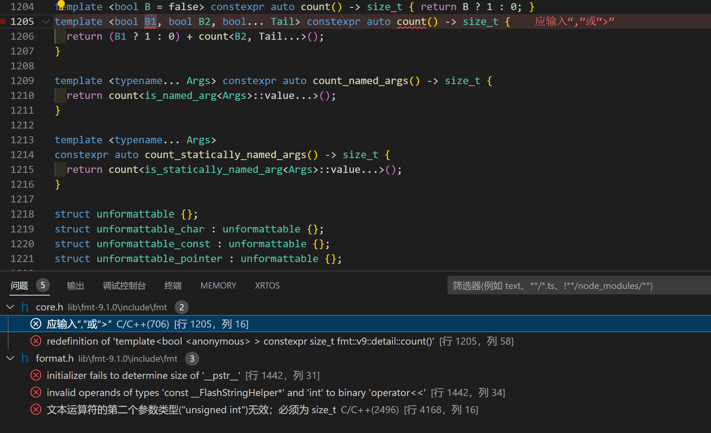
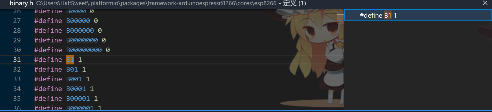
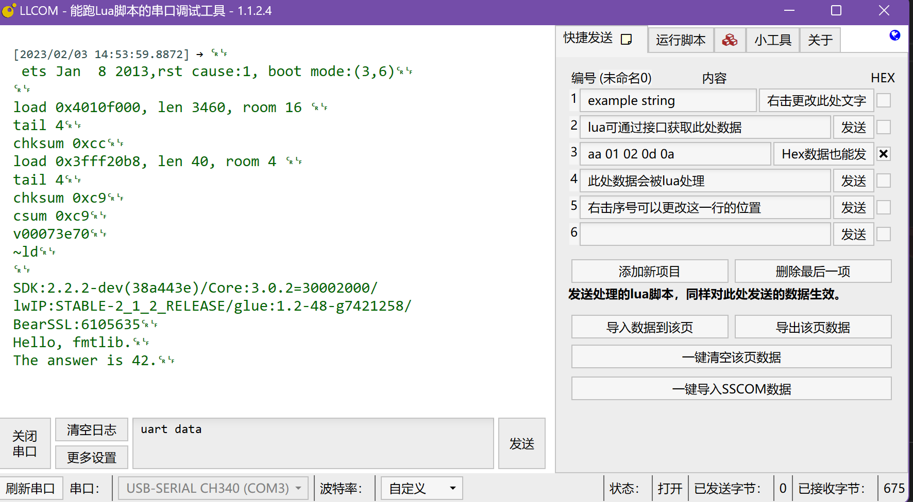

众所周知，在c++20以上的标准已经支持了std::format进行格式化输出，但是在嵌入式领域显然遥遥无期。不给我们已经厌倦了使用sprintf等方式来格式化字符串，c++的流特性又显得不够完善，怎么才能用上类似于Python中format这样的方式来格式化并输出想要的字符串呢。
<!-- more -->

通过去fmtlib的[官网](https://fmt.dev/latest/index.html#portability)查看，我们不难发现，想要使用fmtlib，仅仅需要编译器支持C++11即可，如果版本不够，甚至最低只需要C++98。那么万事俱备只欠东风，让我们来尝试移植吧。

## PlatformIO平台
### 使用Arduino作为框架
#### ESP8266芯片
##### 移植{fmt}库
首先我们下载fmtlib的包，这里我们使用了最新的版本（9.1.0），下载完成之后将其解压到工程目录下的/lib/文件夹中。不过解压好之后不能直接使用，因为在PlatformIO平台下，所以我们需要先在fmtlib库的根目录下添加一个`library.json`文件。这里我们可以参考下面的书写方式：
```json
{
  "name": "fmt",
  "description": "{fmt} is an open-source formatting library providing a fast and safe alternative to C stdio and C++ iostreams.",
  "keywords": "c-plus-plus, performance, cross-platform, formatting, printf, output, multiplatform, chrono",
  "version": "9.1.0",
  "repository": {
    "type": "git",
    "url": "https://github.com/fmtlib/fmt"
  },
  "homepage": "https://fmt.dev",
  "license": "MIT",
  "frameworks": "*",
  "platforms": "*",
  "build": {
    "srcFilter": [
      "+<*>",
      "-<fmt.cc>",
      "-<os.cc>"
    ]
  }
}
```

添加完成之后我们就可以使用这个库了，在`main.cpp`文件中`include <fmt/core.h>`即可使用。这里我们给一段小小的例程：

```cpp
#include <Arduino.h>
#include <fmt/core.h>

void setup()
{
    // put your setup code here, to run once:
    Serial.begin(74880);
    std::string str1 = fmt::format("Hello, fmtlib.");
    std::string str2 = fmt::format("The answer is {}.", 42);
    Serial.println(str1);
    Serial.println(str2);
}

void loop()
{
    // put your main code here, to run repeatedly:
    delay(100);
}
```

但是！编译器显然不满我们这样的NTR行为，很快啊，一下子抛出了好几个error：

这样的报错多少有些驴唇不对马嘴了，怎么回事呢，我百思不得其解。首先进入到了`core.h`文件下仔细看看，却发现在`B1`这个字符上的高亮有些不对劲，`Alt+F12`一看好家伙不得了。

看起来开发者是想要在没有`0bxxxxxxxx`的时候兼容写了一个能表示二进制的宏，但是未免有些过于暴力，并且刚好于`B1`这个字符重复了……

解决方法也很简单，我们修改一下字符即可，把`B1`的字符全部替换为了`_B1`。

然后是`format.h`文件，这里面的问题也是类似的，`F()`竟然也是一个宏……修改方式类似，把所有的`F`字符替换为了`_F`即可。

重新编译，发现没有报错，问题解决。上传到开发板之后，观察串口输出：


##### 重定向stdout，用来直接使用fmt::print
~~ESP8266环境下不需要进行任何操作，官方已经重定义stdout至Serial了[https://github.com/esp8266/Arduino/pull/1752](https://github.com/esp8266/Arduino/pull/1752)~~