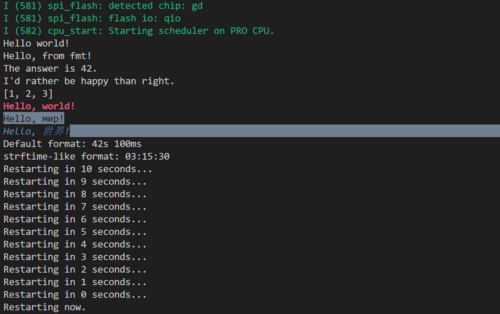

众所周知，在c++20以上的标准已经支持了std::format进行格式化输出，但是在嵌入式领域显然遥遥无期。不给我们已经厌倦了使用sprintf等方式来格式化字符串，c++的流特性又显得不够完善，怎么才能用上类似于Python中format这样的方式来格式化并输出想要的字符串呢。
<!-- more -->

通过去fmtlib的[官网](https://fmt.dev/latest/index.html#portability)查看，我们不难发现，想要使用fmtlib，仅仅需要编译器支持C++11即可，如果版本不够，甚至最低只需要C++98。那么万事俱备只欠东风，让我们来尝试移植吧。

## PlatformIO平台
### 使用Arduino作为框架
#### ESP8266芯片
##### 移植{fmt}库
首先我们下载fmtlib的包，这里我们使用了最新的版本（9.1.0），下载完成之后将其解压到工程目录下的/lib/文件夹中。不过解压好之后不能直接使用，因为在PlatformIO平台下，所以我们需要先在fmtlib库的根目录下添加一个`library.json`文件。这里我们可以参考下面的书写方式：
```json
{
  "name": "fmt",
  "description": "{fmt} is an open-source formatting library providing a fast and safe alternative to C stdio and C++ iostreams.",
  "keywords": "c-plus-plus, performance, cross-platform, formatting, printf, output, multiplatform, chrono",
  "version": "9.1.0",
  "repository": {
    "type": "git",
    "url": "https://github.com/fmtlib/fmt"
  },
  "homepage": "https://fmt.dev",
  "license": "MIT",
  "frameworks": "*",
  "platforms": "*",
  "build": {
    "srcFilter": [
      "+<*>",
      "-<fmt.cc>",
      "-<os.cc>"
    ]
  }
}
```

添加完成之后我们就可以使用这个库了，在`main.cpp`文件中`include <fmt/core.h>`即可使用。这里我们给一段小小的例程：

```cpp
#include <Arduino.h>
#include <fmt/core.h>

void setup()
{
    // put your setup code here, to run once:
    Serial.begin(74880);
    std::string str1 = fmt::format("Hello, fmtlib.");
    std::string str2 = fmt::format("The answer is {}.", 42);
    Serial.println(str1);
    Serial.println(str2);
}

void loop()
{
    // put your main code here, to run repeatedly:
    delay(100);
}
```

但是！编译器显然不满我们这样的NTR行为，很快啊，一下子抛出了好几个error：

这样的报错多少有些驴唇不对马嘴了，怎么回事呢，我百思不得其解。首先进入到了`core.h`文件下仔细看看，却发现在`B1`这个字符上的高亮有些不对劲，`Alt+F12`一看好家伙不得了。

看起来开发者是想要在没有`0bxxxxxxxx`的时候兼容写了一个能表示二进制的宏，但是未免有些过于暴力，并且刚好于`B1`这个字符重复了……

解决方法也很简单，我们修改一下字符即可，把`B1`的字符全部替换为了`_B1`。

然后是`format.h`文件，这里面的问题也是类似的，`F()`竟然也是一个宏……修改方式类似，把所有的`F`字符替换为了`_F`即可。

重新编译，发现没有报错，问题解决。上传到开发板之后，观察串口输出：


##### 重定向stdout，用来直接使用fmt::print
~~ESP8266环境下不需要进行任何操作，官方已经重定义stdout至Serial了[https://github.com/esp8266/Arduino/pull/1752](https://github.com/esp8266/Arduino/pull/1752)~~

## ESP-IDF平台
### 0x00 新建一个工程
我们需要新建一个ESP-IDF的工程，这里直接使用了`hello_world`的例程，新建过程不多赘述。

### 0x01 修改为c++的工程
因为`{fmt}`库是基于c++的，因此我们也需要将工程修改为c++的工程才可以使用。

切换到`main`文件夹下，打开`CMakeLists.txt`文件，将`idf_component_register(...)`中的`SRCS "main.c"`修改为`SRCS "main.cpp"`。

### 0x02 新建fmt组件
我们在工程的根目录下新建一个`components`文件夹，如果已经有了请忽略，然后再在`components`文件夹下新建一个`fmt`的文件夹。然后，我们在该文件夹下新建一个`CmakeLists.txt`文件。在`fmt`文件夹下，使用`git clone`命令克隆`{fmt}`项目。
```bash
git clone https://github.com/fmtlib/fmt.git
```
克隆完成后，我们的工程目录应该是这样子的：
```
│  CMakeLists.txt
│  sdkconfig
│  sdkconfig.ci
│  sdkconfig.old
│
├─build
│  └─ ...
├─components
│  └─fmt
│      │  CMakeLists.txt
│      │
│      └─fmt
│          │  ...
│
└─main
        CMakeLists.txt
        main.cpp
```

### 0x03 编辑CMakeLists.txt文件
在这里，我们需要修改两个`CMakeLists.txt`文件

我们打开`components/fmt/CMakeLists.txt`文件，加入以下内容：
```cmake
idf_component_register(
    INCLUDE_DIRS "fmt/include"
)
```

然后打开`main/CMakeLists.txt`文件，在最后一行加上：
```cmake
add_compile_definitions(FMT_HEADER_ONLY)
```
这一句话的作用相当于是全局定义了一个叫做`FMT_HEADER_ONLY`的宏，具体作用可以参考官方手册。

这样，我们就成功将`{fmt}`库组件加入到了我们的工程中。

### 0x04 编写代码并享受
我们在`main.cpp`中加入如下代码，然后编译烧录并打开监视窗口：
```cpp
#include <stdio.h>
#include "sdkconfig.h"
#include "freertos/FreeRTOS.h"
#include "freertos/task.h"
// #define FMT_HEADER_ONLY
#include "fmt/core.h"
#include <fmt/ranges.h>
#include <fmt/color.h>
#include <fmt/chrono.h>

#include <vector>

extern "C" void app_main(void)
{
    printf("Hello world! \n");
    fmt::print("Hello, from fmt! \n");
    fmt::print("The answer is {}. \n", 42);

    std::string s = fmt::format("I'd rather be {1} than {0}.\n", "right", "happy");
    fmt::print("{}", s);

    std::vector<int> v = {1, 2, 3};
    fmt::print("{}\n", v);

    fmt::print(fg(fmt::color::crimson) | fmt::emphasis::bold,
               "Hello, {}!\n", "world");
    fmt::print(fg(fmt::color::floral_white) | bg(fmt::color::slate_gray) |
                   fmt::emphasis::underline,
               "Hello, {}!\n", "мир");
    fmt::print(fg(fmt::color::steel_blue) | fmt::emphasis::italic,
               "Hello, {}!\n", "世界");

    using namespace std::literals::chrono_literals;
    fmt::print("Default format: {} {}\n", 42s, 100ms);
    fmt::print("strftime-like format: {:%H:%M:%S}\n", 3h + 15min + 30s);

    for (int i = 10; i >= 0; i--)
    {
        fmt::print("Restarting in {} seconds...\n", i);
        vTaskDelay(1000 / portTICK_PERIOD_MS);
    }
    fmt::print("Restarting now.\n");
    fflush(stdout);
    esp_restart();
}
```

观察日志打印：
```
Hello world! 
Hello, from fmt! 
The answer is 42. 
I'd rather be happy than right.
[1, 2, 3]
Hello, world!
Hello, мир!
Hello, 世界!
Default format: 42s 100ms
strftime-like format: 03:15:30
Restarting in 10 seconds...
Restarting in 9 seconds...
Restarting in 8 seconds...
Restarting in 7 seconds...
Restarting in 6 seconds...
Restarting in 5 seconds...
Restarting in 4 seconds...
Restarting in 3 seconds...
Restarting in 2 seconds...
Restarting in 1 seconds...
Restarting in 0 seconds...
Restarting now.
```


