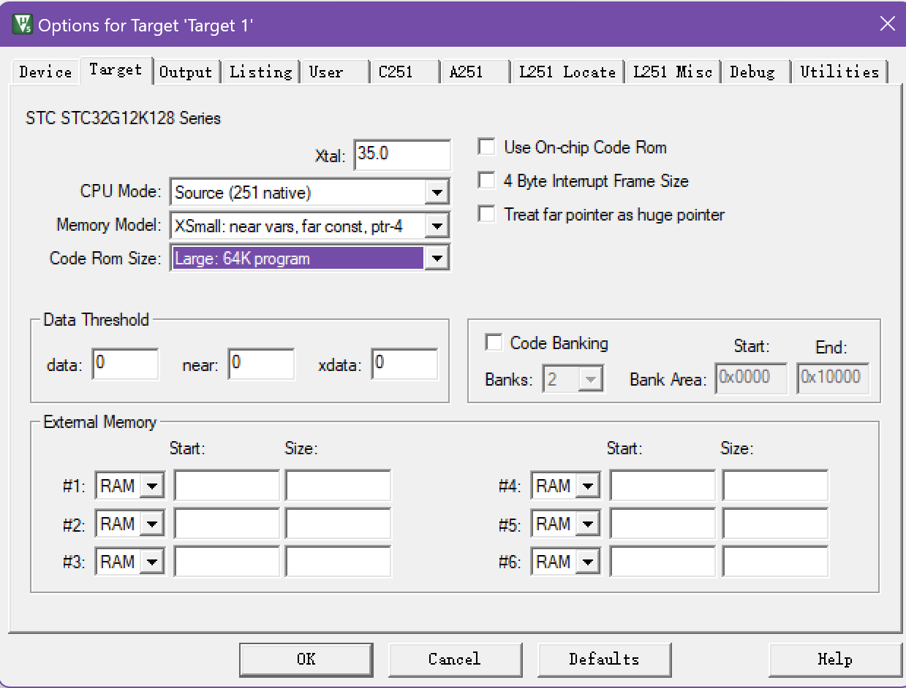
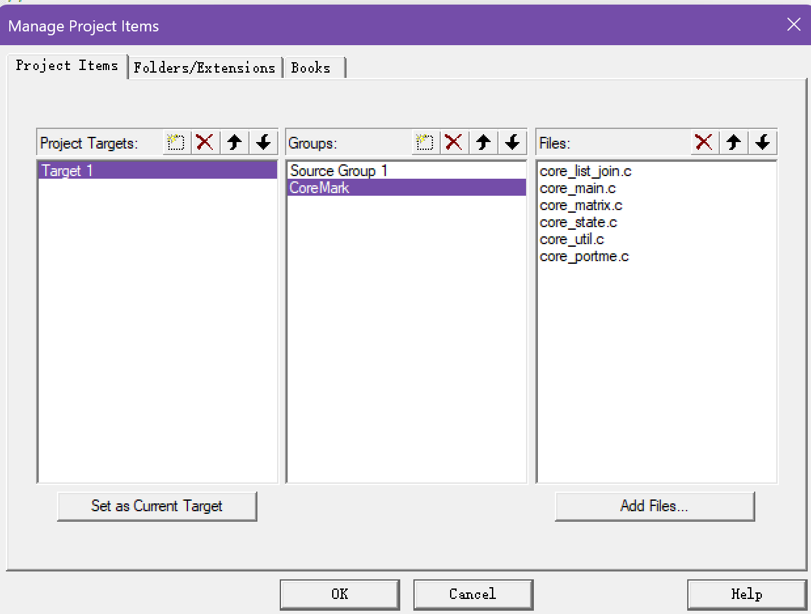
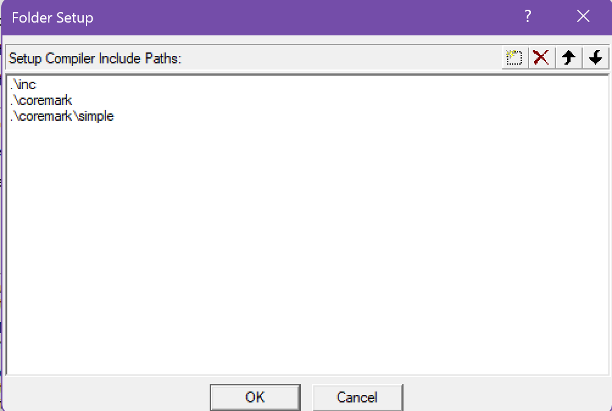

最近维护的Air001准备上线了，为了衬托出其强大的性价比，因此我想来做点~~缺德~~的事，让我们来和同样以高打性价比的STC系列单片机来对比下CoreMark的跑分吧，本文将会详细介绍移植过程以及跑分结果。测试的MCU为`降龙棍 STC32G12K128`与`打狗棒 STC8H8K64U`。
<!-- more -->

## STC32G12K128
### 开启USB-CDC打印Log
我买到的降龙棍开发板非常的HiFi，整个板子上外设除了LED和芯片就没什么了，下载程序都是用的自带的USB-HID的bootloader，然后我又懒得接一个串口模块，因此我们可不可以利用原生的USB，走CDC虚拟串口来打印跑分后的数据呢？

答案当然是肯定的，STC非常的贴心，自带了一个写好的USB库，其中包含了HID和CDC两类主要的操作。那我们就先尝试去移植吧。

#### 下载库文件
STC的USB库文件下载链接为<https://stcai.com/filedownload/656048>，下载后会发现是一个压缩文件，我们将其解压备用。

#### 创建工程
打开Keil，新建一个工程，芯片选择`STC32G12K128`，然后我们复制刚才解压的文件中的`stc32_stc8_usb.h`和`stc_usb_cdc_32g.lib`到我们新建的工程的目录下，并添加进自己的工程中。

#### 编写初始化代码
我们在main.c中添加如下的代码：
```c
#include "stc32g.h"
#include "stc32_stc8_usb.h"
#include "STC32G_Delay.h"

char *USER_DEVICEDESC = NULL;
char *USER_PRODUCTDESC = NULL;
char *USER_STCISPCMD = "@STCISP#"; // 不停电自动 ISP 下载命令

void CDC_init(void);
const char helloStr[] = "Hello World!\r\n";
void main()
{
    CDC_init();
    IE2 |= 0x80; // 使能 USB 中断
    EA = 1;
    while (DeviceState != DEVSTATE_CONFIGURED)
        ; // 等待 USB 完成配置

    while (1)
    {
        USB_SendData((BYTE *)helloStr, sizeof(helloStr));
        delay_ms(1000);
    }
}

void CDC_init(void)
{
    P_SW2 |= 0x80;
    P3M0 &= ~0x03;   // P3.0/P3.1 和 USB 的 D-/D+共用 PIN 脚，
    P3M1 |= 0x03;    // 需要将 P3.0/P3.1 设置为高阻输入模式
    IRC48MCR = 0x80; // 使能内部 48M 的 USB 专用 IRC
    while (!(IRC48MCR & 0x01))
        ;
    USBCLK = 0x00; // 设置 USB 时钟源为内部 48M 的 USB 专用 IRC
    USBCON = 0x90; // 使能 USB 功能
    usb_init();    // 调用 USB CDC 初始化库函数
}
```

::: tip
可能需要注意的是，您需要修改keil中的`Memory Mode`，将其修改为`XSmall`，`Code ROM Size`修改为`Large`
:::



然后编译，发现0 Warning，0 Error，我们下载之后打开串口助手，此时应该能看到每隔一分钟打印一次`Hello World!`。

### 移植CoreMark
#### 下载CoreMark库
我们在工程目录下克隆整个仓库
```bash
git clone https://github.com/eembc/coremark.git
```

#### 在Keil中加入所需的文件
在工程中，加入如下几个文件：`core_list_join.c` `core_main.c` `core_matrix.c` `core_state.c` `core_util.c` s`simple/core_portme.c`，不要忘记把添加include路径



#### 修改CoreMark的具体实现函数
##### 0x01 修改coremark的main函数
首先打开`core_main.c`文件，将里面的`MAIN_RETURN_TYPE main(int argc, char *argv[])`函数重命名为
```c
#if MAIN_HAS_NOARGC
MAIN_RETURN_TYPE
coremark_main(void)
{
    int   argc = 0;
    char *argv[1];
#else
MAIN_RETURN_TYPE
coremark_main(int argc, char *argv[])
```
并在`coremark.h`中添加
```c
#if MAIN_HAS_NOARGC
MAIN_RETURN_TYPE
coremark_main(void);
#else
MAIN_RETURN_TYPE
coremark_main(int argc, char *argv[]);
#endif
```
函数声明，这里是为了解决main函数重复的问题，而我们想要在运行正式的程序之前初始化一些我们自己的外设。

##### 0x02 添加`ee_printf`函数
这里我们没法直接使用printf函数输出，因此选择自己写一个`ee_printf`函数将运行结果输出。我们打开`core_portme.h`文件，将`HAS_PRINTF`的值设定为0，并在文件末尾添加`ee_printf`的函数定义。
```c
#ifndef HAS_PRINTF
#define HAS_PRINTF 0
#endif
```

```c
int ee_printf(const char *fmt, ...);
```

然后我们在`simple`文件夹下新建一个`ee_printf.c`文件，在里面写上`ee_printf`函数的定义。
```c
#include "coremark.h"
#include "stdio.h"
#include "stc32_stc8_usb.h"
#include <stdarg.h>

int ee_printf(const char *fmt, ...)
{
    char buf[32];
	int len;
    va_list args;

    va_start(args, fmt);
    len = vsprintf(buf, fmt, args);
    va_end(args);
    USB_SendData((BYTE *)buf, len);
    return len;
}
```

##### 0x03 添加时钟
接下来我们需要一个时钟源来判断程序运行了多久，显然这很容易。我们采用定时器0作为时钟源，1ms中断一次来进行计数。我们将引入STC标准库中的`STC32G_Timer`与`STC32G_NVIC`，如何添加到工程中不多赘述，初始化等操作也不多赘述，具体可以自行到仓库中查看源代码。此处我们只需要指定，每经过1ms，SysTickFlag将会自增1即可。
::: warning
需要注意，请记得在`STC32G_Timer_Isr.c`中修改中断函数
:::

同样的，在`core_portme.h`文件中，将`HAS_TIME_H`和`USE_CLOCK`的宏定义修改为0，并注释掉`#include <time.h>`，将`CORE_TICKS`的类型修改为`long`。

然后我们进入到`simple/core_portme.c`文件中，重点重写`GETMYTIME`等几个宏，我们将其注释，并替换为如下的代码：
```c
#include "Type_def.h"
extern volatile u32 SysTickFlag;
#define NSECS_PER_SEC              1000
#define CORETIMETYPE               long
#define GETMYTIME(_t)              (*_t = SysTickFlag)
#define MYTIMEDIFF(fin, ini)       ((fin) - (ini))
#define TIMER_RES_DIVIDER          1
#define SAMPLE_TIME_IMPLEMENTATION 1
#define EE_TICKS_PER_SEC           (NSECS_PER_SEC / TIMER_RES_DIVIDER)
```
::: warning
请注意，这时候编译器可能会有很多报错，是因为和关键字重复了，建议查看commit记录查看修改了什么
:::

#### 烧录
使用STC-ISP软件烧录，其中IRC频率修改为最高35M，等待烧录后打开串口查看跑分结果。

::: tip

STC32的CoreMark跑分工程开源仓库为<https://github.com/HalfSweet/STC32G-CoreMark>

:::