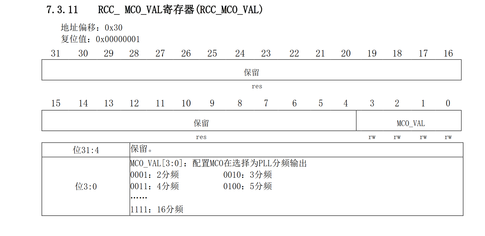

在 [上篇文章](/posts/Air32-HAL-HighFreq/) 中，我们把 HAL 库移植给了 Air32，那现在让我们尝试添加一些 HAL 库特有的功能吧，比如这篇文章中描述的`MCO`。

<!-- more -->

## 关于

MCO 全称为`Microcontroller clock output`，即微控制器时钟输出，它可以将主时钟输出到某个引脚上，这样我们就可以在不消耗任何资源的情况下得到一些特定的时钟信号。

在 STM32F103 中，MCO 对于 PLL 的输出有两种选择，分别是 PLL/2 和 PLL/3，但是这对于主频高达 256M 的 Air32 来说显然是不够的，因为其 GPIO 输出最大仅 50M。因此 Air32 有了专属的一个寄存器来控制 MCO 的输出，这个寄存器就是`RCC_MCO_VAL`，其相对 RCC 的偏移量为`0x30`。



## 添加寄存器地址

因为这个寄存器是 Air32 独有的，因此我们需要单独添加。我们在芯片的头文件中的`RCC_TypeDef`结构体中进行添加，我们此处以`air32f103xb.h`为例，添加的代码如下：

```c
typedef struct
{
  __IO uint32_t CR;
  __IO uint32_t CFGR;
  __IO uint32_t CIR;
  __IO uint32_t APB2RSTR;
  __IO uint32_t APB1RSTR;
  __IO uint32_t AHBENR;
  __IO uint32_t APB2ENR;
  __IO uint32_t APB1ENR;
  __IO uint32_t BDCR;
  __IO uint32_t CSR;

  __IO uint32_t RCC_RSVD1[(0x30-0x28) >> 2];
  __IO uint32_t RCC_MCO_VAL;
  __IO uint32_t RCC_RSVD2[(0xF0-0x34) >> 2];
  __IO uint32_t RCC_SYSCFG_CONFIG;

} RCC_TypeDef;
```

## 添加 RCC_MCO_VAL 的定义

同样，我们需要添加 RCC_MCO_VAL 的具体内容，同样在`air32f103xb.h`中添加，为了兼容性，我们选择高位和`RCC_CFGR_MCO_PLLCLK_DIV2`一致，即`0x07000000U`，而最后一位即为实际的定义，因此我们添加的代码如下：

```c
#define RCC_MCO_PLLCLK_DIV2                  (0x00000001U | RCC_CFGR_MCO_PLLCLK_DIV2)
#define RCC_MCO_PLLCLK_DIV3                  (0x00000002U | RCC_CFGR_MCO_PLLCLK_DIV2)
#define RCC_MCO_PLLCLK_DIV4                  (0x00000003U | RCC_CFGR_MCO_PLLCLK_DIV2)
#define RCC_MCO_PLLCLK_DIV5                  (0x00000004U | RCC_CFGR_MCO_PLLCLK_DIV2)
#define RCC_MCO_PLLCLK_DIV6                  (0x00000005U | RCC_CFGR_MCO_PLLCLK_DIV2)
#define RCC_MCO_PLLCLK_DIV7                  (0x00000006U | RCC_CFGR_MCO_PLLCLK_DIV2)
#define RCC_MCO_PLLCLK_DIV8                  (0x00000007U | RCC_CFGR_MCO_PLLCLK_DIV2)
#define RCC_MCO_PLLCLK_DIV9                  (0x00000008U | RCC_CFGR_MCO_PLLCLK_DIV2)
#define RCC_MCO_PLLCLK_DIV10                 (0x00000009U | RCC_CFGR_MCO_PLLCLK_DIV2)
#define RCC_MCO_PLLCLK_DIV11                 (0x0000000AU | RCC_CFGR_MCO_PLLCLK_DIV2)
#define RCC_MCO_PLLCLK_DIV12                 (0x0000000BU | RCC_CFGR_MCO_PLLCLK_DIV2)
#define RCC_MCO_PLLCLK_DIV13                 (0x0000000CU | RCC_CFGR_MCO_PLLCLK_DIV2)
#define RCC_MCO_PLLCLK_DIV14                 (0x0000000DU | RCC_CFGR_MCO_PLLCLK_DIV2)
#define RCC_MCO_PLLCLK_DIV15                 (0x0000000EU | RCC_CFGR_MCO_PLLCLK_DIV2)
#define RCC_MCO_PLLCLK_DIV16                 (0x0000000FU | RCC_CFGR_MCO_PLLCLK_DIV2)
```

## 修改 IS_RCC_MCO1SOURCE 宏定义

`IS_RCC_MCO1SOURCE`宏的作用是检测参数是否合法，我们添加了一些参数，因此我们需要修改这个宏，我们修改后的代码如下：

```c
#define IS_RCC_MCO1SOURCE(__SOURCE__) (((__SOURCE__) == RCC_MCO1SOURCE_SYSCLK)  || ((__SOURCE__) == RCC_MCO1SOURCE_HSI) \
                                    || ((__SOURCE__) == RCC_MCO1SOURCE_HSE)     || ((__SOURCE__) == RCC_MCO1SOURCE_PLLCLK) \
                                    || ((__SOURCE__) == RCC_MCO1SOURCE_NOCLOCK) || ((__SOURCE__) == RCC_MCO1SOURCE_PLLCLK_DIV3) \
                                    || ((__SOURCE__) == RCC_MCO1SOURCE_PLLCLK_DIV4) || ((__SOURCE__) == RCC_MCO1SOURCE_PLLCLK_DIV5) \
                                    || ((__SOURCE__) == RCC_MCO1SOURCE_PLLCLK_DIV6) || ((__SOURCE__) == RCC_MCO1SOURCE_PLLCLK_DIV7) \
                                    || ((__SOURCE__) == RCC_MCO1SOURCE_PLLCLK_DIV8) || ((__SOURCE__) == RCC_MCO1SOURCE_PLLCLK_DIV9) \
                                    || ((__SOURCE__) == RCC_MCO1SOURCE_PLLCLK_DIV10) || ((__SOURCE__) == RCC_MCO1SOURCE_PLLCLK_DIV11) \
                                    || ((__SOURCE__) == RCC_MCO1SOURCE_PLLCLK_DIV12) || ((__SOURCE__) == RCC_MCO1SOURCE_PLLCLK_DIV13) \
                                    || ((__SOURCE__) == RCC_MCO1SOURCE_PLLCLK_DIV14) || ((__SOURCE__) == RCC_MCO1SOURCE_PLLCLK_DIV15) \
                                    || ((__SOURCE__) == RCC_MCO1SOURCE_PLLCLK_DIV16) || ((__SOURCE__) == RCC_MCO1SOURCE_PLLCLK_DIV2))
```

## 添加 MCO1 Clock Source 相关宏定义

在`air32_hal_rcc_ex.h`中，我们还需要补全相关宏定义，以便于和原来的风格相似，我们添加如下代码

```c
#define RCC_MCO1SOURCE_PLLCLK_DIV2       ((uint32_t)RCC_MCO_PLLCLK_DIV2)
#define RCC_MCO1SOURCE_PLLCLK_DIV3       ((uint32_t)RCC_MCO_PLLCLK_DIV3)
#define RCC_MCO1SOURCE_PLLCLK_DIV4       ((uint32_t)RCC_MCO_PLLCLK_DIV4)
#define RCC_MCO1SOURCE_PLLCLK_DIV5       ((uint32_t)RCC_MCO_PLLCLK_DIV5)
#define RCC_MCO1SOURCE_PLLCLK_DIV6       ((uint32_t)RCC_MCO_PLLCLK_DIV6)
#define RCC_MCO1SOURCE_PLLCLK_DIV7       ((uint32_t)RCC_MCO_PLLCLK_DIV7)
#define RCC_MCO1SOURCE_PLLCLK_DIV8       ((uint32_t)RCC_MCO_PLLCLK_DIV8)
#define RCC_MCO1SOURCE_PLLCLK_DIV9       ((uint32_t)RCC_MCO_PLLCLK_DIV9)
#define RCC_MCO1SOURCE_PLLCLK_DIV10      ((uint32_t)RCC_MCO_PLLCLK_DIV10)
#define RCC_MCO1SOURCE_PLLCLK_DIV11      ((uint32_t)RCC_MCO_PLLCLK_DIV11)
#define RCC_MCO1SOURCE_PLLCLK_DIV12      ((uint32_t)RCC_MCO_PLLCLK_DIV12)
#define RCC_MCO1SOURCE_PLLCLK_DIV13      ((uint32_t)RCC_MCO_PLLCLK_DIV13)
#define RCC_MCO1SOURCE_PLLCLK_DIV14      ((uint32_t)RCC_MCO_PLLCLK_DIV14)
#define RCC_MCO1SOURCE_PLLCLK_DIV15      ((uint32_t)RCC_MCO_PLLCLK_DIV15)
#define RCC_MCO1SOURCE_PLLCLK_DIV16      ((uint32_t)RCC_MCO_PLLCLK_DIV16)
```

## 修改 HAL_RCC_MCOConfig 函数

最后，我们需要对原有的`HAL_RCC_MCOConfig`函数进行修改，使其能够适配 Air32，我们修改后的代码如下：

```c
void HAL_RCC_MCOConfig(uint32_t RCC_MCOx, uint32_t RCC_MCOSource, uint32_t RCC_MCODiv)
{
  GPIO_InitTypeDef gpio = {0U};

  /* Check the parameters */
  assert_param(IS_RCC_MCO(RCC_MCOx));
  assert_param(IS_RCC_MCODIV(RCC_MCODiv));
  assert_param(IS_RCC_MCO1SOURCE(RCC_MCOSource));

  /* Prevent unused argument(s) compilation warning */
  UNUSED(RCC_MCOx);
  UNUSED(RCC_MCODiv);

  /* Configure the MCO1 pin in alternate function mode */
  gpio.Mode      = GPIO_MODE_AF_PP;
  gpio.Speed     = GPIO_SPEED_FREQ_HIGH;
  gpio.Pull      = GPIO_NOPULL;
  gpio.Pin       = MCO1_PIN;

  /* MCO1 Clock Enable */
  MCO1_CLK_ENABLE();

  HAL_GPIO_Init(MCO1_GPIO_PORT, &gpio);

  /* Configure the MCO clock source */
  if(RCC_MCOSource <= RCC_MCO1SOURCE_PLLCLK)
  {
    __HAL_RCC_MCO1_CONFIG(RCC_MCOSource, RCC_MCODiv);
  }
  else
  {
    __HAL_RCC_MCO1_CONFIG(RCC_MCO1SOURCE_PLLCLK, RCC_MCODiv);
    RCC->RCC_MCO_VAL = (RCC_MCOSource & 0x0F);
  }
}
```

至此，我们就完成了对 MCO 的添加，接下来我们就可以在 HAL 库中使用 MCO 了。我们只需要调用`HAL_RCC_MCOConfig`即可使用 MCO 输出，例如：

```c
HAL_RCC_MCOConfig(RCC_MCO1, RCC_MCO1SOURCE_PLLCLK_DIV16, RCC_MCODIV_1);
```

即可以 16 分频输出 PLL 的时钟信号。

## 附录

测试的代码可以参考<https://github.com/Air-duino/Air32F103-HAL-RCC>
