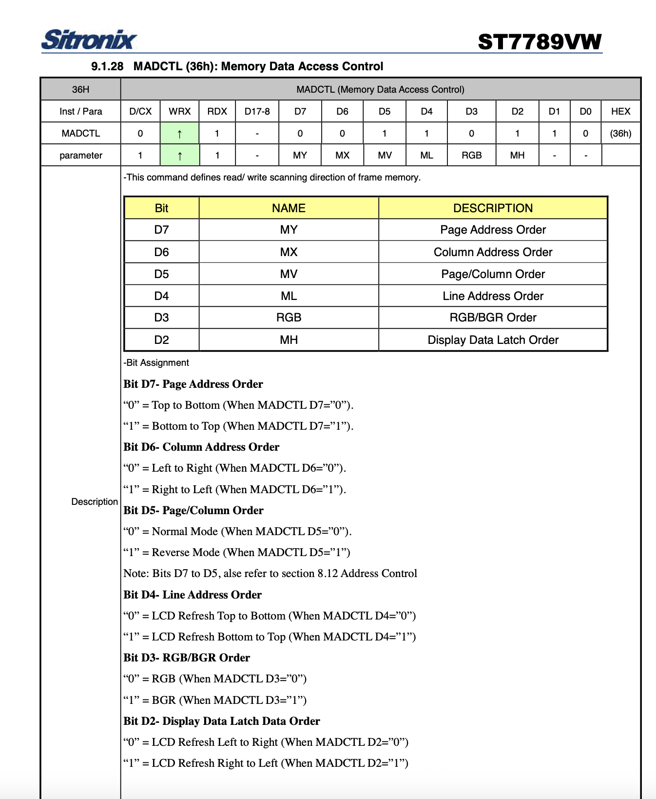
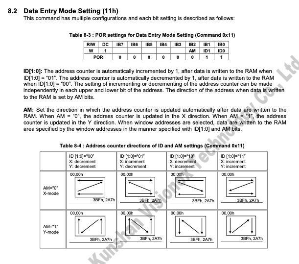
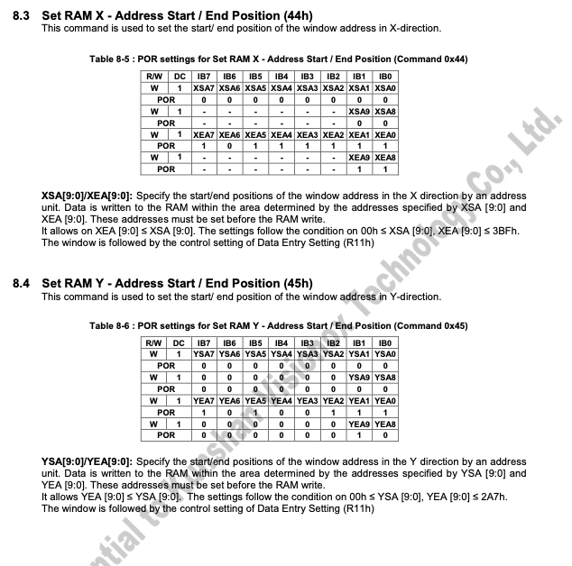
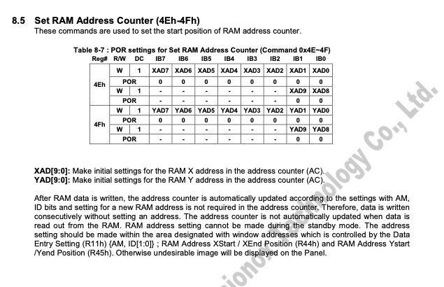
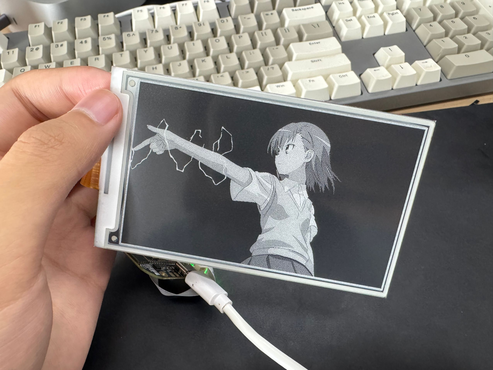

今天又重新开始玩墨水屏了，这次手里的是一块 4.26 寸的 800*480 的墨水屏，PPI 非常不错。用的驱动芯片是 SSD1677，算是比较常规的配置。但是在使用的时候发现有一个问题，正常的图像 buffer 是从左上角开始，从左到右，从上到下进行填充的。但是在使用的时候发现图像沿着 X 轴镜像了。

<!-- more -->

对于常见的 TFT 彩屏来说这个问题很简单，只需要修改一个寄存器就好。比如对于常见的 ST7789 芯片来说，只需要修改寄存器 `MADCTL(36h)` 的值就可以了。

抱着墨水屏可能也有类似的做法，我们很快就找到了 SSD1677 中的 `Data Entry Mode Setting`寄存器 (0x11)。

默认情况下，我们设置的值是 0x03。按道理来说其实是可以正常工作的，但是不知道为啥这里镜像了。但是按照这个寄存器的说明，我们只需要让 X 的递增方向改变即可，也就是设置为 0x02。

但是现实没有那么幸运，当我修改完之后，发现整块屏幕都变成了诡异的花屏状态。

经过了很长时间的排查，才发现原来 SSD 的芯片比较傻，修改完这个寄存器之后开窗和地址计数器也需要修改……

好吧，不过修改内容并不多，之前的开窗区域是`((0, 800), (0, 480))`。我们修改为`((800, 0), (0, 480))`即可。以及还有`0x4E`的地址计数器，我们也修改成 800 即可。

经过修改之后，屏幕终于正常点亮，并且图像也正常显示了。

