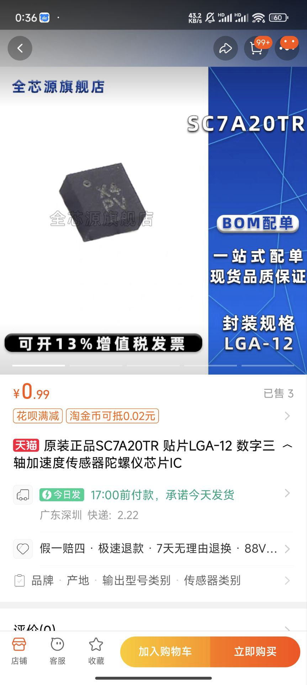

最近第三代郊狼开始内测了，作为一名电子爱好者，自然不能错过这个机会。于是我以原价398元的主机，以及128元两个智能按钮的价格，购买了一套第三代郊狼。

<!-- more -->

失望是从快递到手开始的，当到手之后我拆开，发现里面的竟然是飞机盒而不是之前的推拉式盒子。这个细节让我感觉有些失望，不过在打开盒子之后有了一些慰藉。因为里面给了一个收纳包，这点很好，当时我甚至很兴奋。

　
但是随着东西的拆解，所有的设备都被我摆在了桌上，我想，这就是它们的全部了吗？

主机和上一代几乎没有任何区别，只是改了个型号和加入了RGB灯，其余的结构件完全一致。此时的我稍稍有些失望，但是转念一想，玩意它的内功深厚，在内在进行了非常大的提升了呢。怀着这样的想法我把它拆了。

## 主机拆解

拆解过程很简单，只需要加热一下其中一面的面板一段时间，等胶水软化之后可以用吸盘去吸住拉下来，这个应该可以真无损拆解。而对于面板等另一面，稍微加热之后从内部往外部顶处即可，完全无损。

## 主机规格分析

不难看出，此次虽然宣称采用了第三代的技术，优化了所谓高压结构，但是实际上也不过是加一个硬件的过流的电路，并且在输出口加入了TVS以防止输出太高电压。但是仅此而已。

有意思的点是，此次方案和2.0的硬件拓扑架构相似，那么理论上软件性能也应该差不多，但是我们测量了输出管子的PWM频率，发现仅仅才2kHz，这个数字非常离谱。作为对比，上一代的PWM输出频率达到了4kHz，高了近一倍。

详细的报告等待我朋友使用更专业的仪器去测量

## 按钮拆解

按钮的拆解也很简单，只需要用一把小螺丝刀即可，记住大力出奇迹，它的本质不过就是一个带卡扣的外壳，所以只要稍微用力即可拆开。

## 按钮规格分析

可以看出，它用的是上海博通的射频方案，这个我不太了解会去查阅，但是影视一颗非常廉价的MCU。然后IMU应该是不到两块钱的采购成本。

并且微动的手感很差，触发力度极低，不知道目的是什么，反正用着非常难。

总而言之，128元两个，我就是纯纯的冤种。

## 主机的一些小问题

其实主机端也存在一些问题，例如有被换下的电阻，并且上面还有残留的助焊剂，非常的低劣。

这样的位置不止一处。

## 总结

经过我多次测量，这个第三代郊狼的性能并没有得到提升，甚至还有一些问题。我对此非常失望，因为我本来对它寄予了很大的期望，并且也接受了一次又一次的延期。但是最终获得的这个产品让人感觉就是纯粹的噶韭菜，并且毫无诚意。

另外，在2代上，输出的pwm频率大约为4k，但是在3代上，这个频率降低到了2k，这个降低的频率会导致痛感增加。当然好处嘛，可能就开发更简单了。