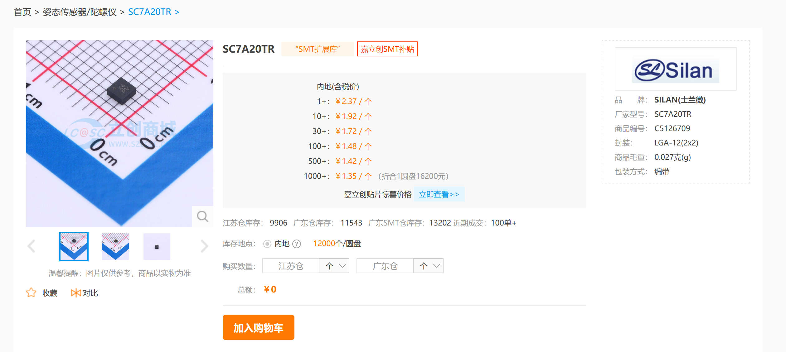

最近第三代郊狼开始内测了，作为一名电子爱好者，自然不能错过这个机会。于是我以原价 368 元的主机，以及 128 元两个智能按钮的价格，购买了一套第三代郊狼。

<!-- more -->

失望是从快递到手开始的，当到手之后我拆开，发现里面的竟然是飞机盒而不是之前的推拉式盒子。这个细节让我感觉有些失望，不过在打开盒子之后有了一些慰藉。因为里面给了一个收纳包，这点很好，当时我甚至很兴奋。

但是随着东西的拆解，所有的设备都被我摆在了桌上，我想，这就是它们的全部了吗？

主机和上一代几乎没有任何区别，只是改了个型号和加入了 RGB 灯，其余的结构件完全一致。此时的我稍稍有些失望，但是转念一想，玩意它的内功深厚，在内在进行了非常大的提升了呢。怀着这样的想法我把它拆了。

## 主机拆解

拆解过程很简单，只需要加热一下其中一面的面板一段时间，等胶水软化之后可以用吸盘去吸住拉下来，这个应该可以真无损拆解。而对于面板等另一面，稍微加热之后从内部往外部顶处即可，完全无损。

## 主机规格分析

### 电源环路

在宣传页中，厂商宣称优化了升压架构。但是经过初步分析，实质上的电源拓扑和第二代其实并无太大差异，依然是采用的开环 boost 拓扑。

但还是存在着一些差异，不难看出此次的电感和电容均换成了贴片，整体的功率相比前一代应该是有所降低。并且同时也可以看出，在输出端并联了一个 TVS 二极管用来限制最高输出电压，按照丝印分析，应该是 91V 的 TVS。这个数据相较于输出母线上的 100V 耐压的电解电容来说，还是稍微有一点极限了。

在第二代中，也有 TVS 进行限压，但是当初使用的是 150V 的 TVS，因此理论上来说第三代的最高输出电压是更低的。从后面的实测中也能看出，开到最高的挡位（200）后，输出的电压峰峰值约为 130.667V，而在第二代中峰峰值则约为 270V。

::: note
测试条件均为大约 500 欧的纯阻性负载下进行。
:::

另外有趣的是，在上一代中输出有一个光耦与一个二极管，其中应该是采取反向并联的方式串入回路中。这样主控理论上可以检测到是否存在负载，但是遗憾是只能检测到半周的数据。而这一代中可以看出每一路的输出有 3 个光耦，并且 LED 输出指示的设计依然被保留了下来。至于这 3 个光耦是如何分配的，还需要进行进一步的分析。

另外，在官方的宣传页中，宣称加入了过流保护，最大电流不会超过 50mA，这个部分猜测应该是用的那两颗巨大的 1k 电阻进行采样，并且使用 LM393 比较器进行硬件地切断输出。这个部分相比二代的可能是纯软件的限流措施来说，确实有一定的提升。当然值得注意的是，这依然无法做到硬件级别的可调输出电流，并且也未知能否通过软件的方式作为最高电流的限制。

### 主控

第三代的主控芯片和上一代一样，依旧采用的是`nRF52832`，并且有意思的是它的生产日期依然是 2022 年，清库存实锤了（

::: details 碎碎念
猜测其实和第二代的软件部分也不会差太多，纯纯的炒冷饭。
:::

在板子上我还发现了有一颗被磨标的 TSSOP-16 封装的芯片，但是不知道具体的作用是什么，如果有能猜测出来的同学可以偷偷在评论区里告诉我（（

### 电池管理

和第二代一样，电池的充电芯片依然采用的是`SGM4056`，`TDFN-3×3-8`封装。至于锂电池的保护应该是交给内置的保护板进行处理。

## 按钮拆解

按钮的拆解也很简单，只需要用一把小螺丝刀即可，记住大力出奇迹，它的本质不过就是一个带卡扣的外壳，所以只要稍微用力即可拆开。

## 按钮规格分析

相比于主机，配套的按钮整体的复杂度低了不少，本质上就是一个一堆开关与一个 IMU 通过一个 BLE 的主控透传出去。

### 主控

主控使用的是上海博通的方案，具体的型号为`BK3432`。支持双模蓝牙和 2.4G 的通信。但是值得注意的是它的内置 ADC 仅仅只有 10bit，对于官方宣称的可以使用 Type-C 的 CC1 进行外部电压检测功能来说，ADC 的性能可能会造成一些玩法上的限制。

### IMU

根据芯片的丝印分析，IMU 使用的应该是`SC7A20`，这个方案的优势就是成本非常的廉价，在淘宝上大部分的售价均在一元人民币左右。当然缺点嘛……就是它至少一个普通的 3 轴加速度计，不支持角速度，也不支持陀螺仪的相关功能。使用的拓展性势必会造成一定的限制。

### 按键

按键采用的是微动开关，但是个人感觉因为结构的限制，只有几个弹簧支承上下壳体，因此手感会比较差，触发力度非常低，当然考虑到应用场景，可能也算是 play 的一环吧 (￣﹃￣)

另外个人感觉这个微动开关的声音有些略大了，在安静的环境中会非常明显，就像是有人不断在点击鼠标一样。对我来说如果是在比较公开的场合来说，还是希望能换成一些声音较小的微动。

按钮的定价的话目前是 128 人民币两个，就成本来说我个人感觉还是蛮贵的……

## 一些奇奇怪怪的问题

### 主机端

主机端有一个非常有意思的东西，在 PCB 上可以看到有一些二次焊接的痕迹，比如说 R80 这个电阻就被拆掉了，上面的助焊剂甚至都没有清理干净。这样的痕迹也不止一处。

### 执行标准

在包装盒上出现了一个所谓的“执行标准”，但是经过查阅之后发现并不存在相关的国家标准，这个应该是官方自造的一个标准。这个就有点难绷了。

## 总结

相比二代的主机来说，三代主机并没有得到本质的提升，软件方面应该是大差不差的，仅仅是在硬件上进行了一些不大不小的升级。对于鸽了大半年，并且距离上一代已经很多年的产品来说，我感觉很难感觉到有什么诚意。并且更令人失望的是，二代和三代的结构件是完全一致的，仅仅只是前面板修改了一下版本，而中框和后面板则完全一致。

在一些比较关键的元件上，甚至有一些缩水，比如最高的输出电压，以及升压电感和电容。在第二代上存在一个问题，长时间使用之后升压部分会变得非常热，并且甚至可能会烫伤用户，在第三代中这个问题势必会变得更严重。至于有没有添加诸如 NTC 之类的保护措施，就目前肉眼所见的情况来看，是没有的。不过目前我没有热成像，因此也暂时没法进行长时间的压力测试了，这个以后会补上。

对于外置的按键来说，想法很有心意，但是落实到具体的产品上依旧让人感受到了一种敷衍。硬件采用的基本都是最低最便宜的方案，对于这个售价来说属实不应该，非常亏。

总而言之，对于拥有老款主机的用户来说，我并不是很推荐购买新款，因为真的没什么区别。当然如果是对于在观望的新用户来说，可能可以满足你的需求，但是一定不会远远超出预期，最好先问问自己是否真的需要，如果是刚需再购买，否则一定一定会后悔。

我并不反对高价的产品，但是我非常反感一边卖高价一边采用 costdown 方案。因为这减少的不仅只有成本，还有性能。
