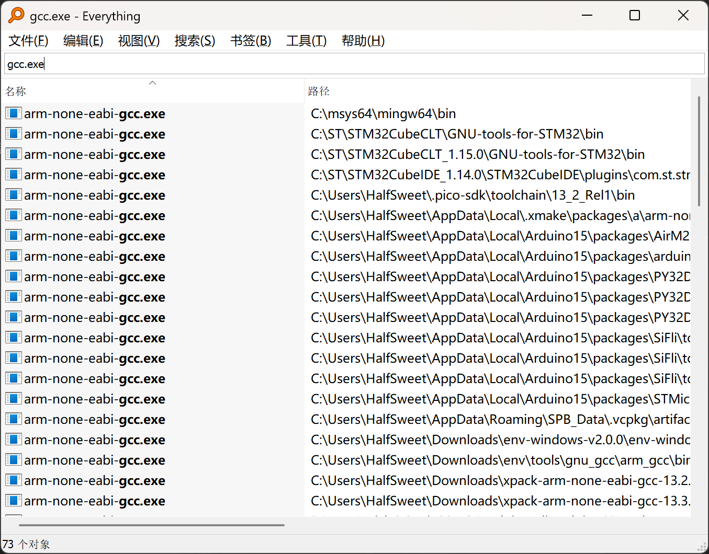

今天在整理电脑的时候，发现我的电脑上有高达 73 个GCC。因此本文将重现为什么我会装那么多GCC的过程，并探求一下背后的一些有趣的事情。

<!-- more -->

不过其实不难发现，虽然看起来有很多，但是实际上大部分其实都是重复的，只是一些环境为了避免冲突，一般会自带一个经过验证确保可用的二进制版本。而另一个造成数量膨胀的原因则是安装了很多个不同版本的。

但是有一个令人在意的点，这里面出现了一些形如`arm-none-eabi-gcc`或者`riscv32-unknown-elf-gcc`的GCC，这些和没有任何前缀的有什么区别呢。这其实就引入了一个新的概念：交叉编译。

## 什么是交叉编译

正常情况下，我们在编译一个程序的时候，我们会使用和我们的电脑一样的架构，比如说我们的电脑是 x86 架构，那么我们就会使用 x86 架构的编译器来编译我们的程序。但是如果我们期望运行的目标设备是不同架构的，那么我们就需要使用交叉编译器来构建。举个例子，我们常用的有一些嵌入式设备，比如说 `STM32G030`，它的真实的架构类型是 `Arm Cortex-M0+`，而我们的电脑一般来说是 x86 架构，这时候我们就需要一个交叉编译器来构建属于这个设备的二进制。

## 为什么需要交叉编译

对于编译器来说，编译的本质实际上是将源代码转换为一段可执行文件，但是这个可执行文件的运行“平台”与运行编译器的平台并不一定相同。而在这个上下文中所谓的“平台”其实是一组元素的集合：硬件、操作系统、ABI、系统接口等。

在一些环境中，交叉编译是刚需，例如在开发MCU软件时，我们显然没办法找到一个可以运行GCC的裸机环境，因此我们就不得不找到一个可以运行GCC的环境，然后使用交叉编译器来构建我们的程序。当然随着时代的发展，之前一些可能需要交叉编译的场景也在逐渐减少。例如开发运行在`Aarch64`架构的Linux系统上的程序的时候，理论上我们可以找一个性能较强的处理器，编译完成之后再复制到性能较差的目标设备上运行。

~~这听起来好像和开发一般的桌面端软件没什么差异了~~

## GCC 架构

现在我们尝试来解释为什么为什么不同的处理器会有不同的GCC。我们以常见的`espressif`举例，我们发现它在我的系统中装了如下的编译器：

- `xtensa-esp32-elf-gcc`
- `xtensa-esp32s2-elf-gcc`
- `xtensa-esp32s3-elf-gcc`
- `xtensa-esp-elf-gcc`
- `riscv32-esp-elf-gcc`

天呐，它提供了至少有五个不同的编译器，占用了4.32 GB的硬盘空间。那我们不由得要问，这些难道不能合并吗？

在尝试了解GCC的架构之前，我们可以先复习一下编译原理。一般来说，编译器可以分为三个部分：前端、中端和后端。

### 前端

对于一个编译器，我们可以给出一些输入，也就是所谓的源代码。我们可以将这一份源码看作一个比较长的字符串，然后我们首先需要对它进行预处理，比如说在C/CPP里面常见的`#define`、`#ifdef`等语句都是在这个阶段进行处理。（当然除了C/CPP以外，现代的编程语言似乎都抛弃了预处理这个过程，直接到下一步

接下来我们就要进行词法分析，将这个长长的字符串分割成一个个的token。这个过程中我们可以识别到一些语言的关键字、变量名等等。

然后我们会进行语法分析，将这些token组合成一个个的语法树。这个过程中我们可以识别到一些语法错误，比如说括号不匹配等等。

接下来是语义分析，语义分析是上下文相关的，这也就意味着我们可以检测到一些符合语法但是不符合语义的错误。例如C里面常见的变量未经声明就使用。当然语义分析还可以做一些更多的事，例如一般`*`代表乘法，但是在C中`uintptr_t * a = NULL`中`*`却代表的是指针。

### 中端

经过了这些步骤之后，我们终于可以说我们完成了所谓的`前端`工作了！但是这只是一个开始，接下来我们就要进入`中端`了。对于一些教科书来说，中端做的工作似乎很简单，只需要将AST转换为某种中间代码即可。但是事实上在工业界中端的工作远远不止这些，对于GCC来说，它会将AST先转化为一种叫做`GIMPLE`的东西，然后在GIMPLE层上加入控制流程图(CFG)，在CFG上我们可以再进行加入一些优化。

这样的行为我们就将其称之为中间表示(intermediate representation, 简称为IR)。在编译过程中，各个阶段都在IR上进行分析或优化变换，因此IR的设计对于编译器的性能和功能有着至关重要的作用。同时一个合理的IR设计也可以使得编译器的前端和后端可以相对独立地进行开发。对前端来说，优秀的IR设计可以支持多语言的映射；而对于后端来说，优秀IR的设计可以使得后端可以更方便地对接不同的硬件平台，也方便进行各种平台特化的优化。

IR的思想使得我们大大减低开发各个语言和各个平台所需编译器的工作量，并且这样的设计思想也体现到了其它领域。例如JVM实质上也是一个IR，这样的设计也使得Java可以喊出“一次编译，到处运行”的口号。

对于GCC来说，它的IR其实比较复杂，在AST阶段采用了`GENERIC`来表示，GENERIC是和前端语言强相关的。而总所周知GCC其实是好多种语言编译器的一个集合（虽然我们一般只用c/cpp），因此不同语言前端生成的GENERIC结构上是不同的。在此我们将不探究GENERIC的具体细节。~~我太菜了~~

然后编译器会将GENERIC转换为`GIMPLE`。与GENERIC不同的是，GIMPLE引入了一种叫做三地址码的表示方法，更方便进行优化。当然具体的细节我们也不探究。

### 后端

这时候我们终于可以进入后端部分了。在后端部分，我们会将GIMPLE转换为RTL（Register Transfer Language），这个过程中我们会将GIMPLE转换为一种更接近于硬件的表示方法。在这个过程中我们同样可以进行一些优化，但是主要是和平台相关的优化。例如对于一些不支持4byte对齐访问的平台上我们可以尽量将变量都对齐到4byte。

最后，我们会将RTL转换为汇编代码，至此我们的编译过程就基本完成了。

当然最后理论上我们还需要将汇编代码转换为机器码，但是因为汇编代码一般都是和机器码一一对应，因此汇编器的设计一般比较简单，不太会进行太多的优化。

### 总结

经过这一个流程之后我们发现，和硬件平台相关的似乎只有后端部分，而前端和中端的部分其实是和硬件平台无关的。但是因为GCC的架构设计耦合性较高，因此实际很难将其分离。因此这也就导致了遇到平台差异较大的平台，我们只能修改后端部分之后打包成一个新的可执行文件，即使前端和中端部分的代码是一样的。

而所谓的厂商魔改的GCC，其实大概率也就是修改了一部分的后端代码，然后再进行重新编译而已。

## GCC编译器的命名规则

我们知道，对一个CLI程序来说，其实是无所谓其名称的，但是一般来说为了区分不同的交叉编译器，我们会在其名称中加入一些前缀。这些前缀的一般规则为`arch [-vendor] [-os] - eabi`，其含义为：

- `arch`：目标处理器的架构，例如`arm`、`riscv`等
- `vendor`：供应商，例如`espressif`等，是可选项。
- `os`：目标操作系统，例如`linux`等，是可选项。
- `eabi`：目标的ABI，例如`eabi`、`gnueabi`等。

当然这样的规则是比较松散的约定俗成，理论上厂商可以完全不遵守。例如一些人喜欢把riscv32的编译器命名为`riscv32-unknown-elf-gcc`，而另一些人则喜欢把它命名为`riscv-none-elf-gcc`。

## 如何选择合适的GCC

事实上，一个交叉编译器其实是可以为多种微小变体的架构编译的。例如常见的`arm-none-eabi-gcc`就可以编译`corrtex-m0`、`corrtex-m3`、`corrtex-m4`等，并且还可以选择是否存在`fpu`等特性。而这类相似的架构实际上可以通过编译时configure的`--target`参数来指定。GCC目前支持的target可以在这个网站上获取: <https://gcc.gnu.org/install/specific.html>。

顺便多嘴一句，该编译器支持的架构的变体可以通过`-mcpu`、`-mfpu`参数来指定，如果你不清楚支持哪些，可以运行诸如`arm-none-eabi-gcc -mcpu=help`的命令来查询。

## 为什么编译器不能把所有的架构都支持

事实上这样想的人不少，但是GCC的架构确实积难重返。因此比较新一点的框架例如LLVM就将所有支持的后端都打包在了一起。它的工具例如`clang`在进行交叉编译的时候仅需要指定`-target`参数即可。

当然如果你喜欢的话，clang同样也可以只打包一个后端进去。
