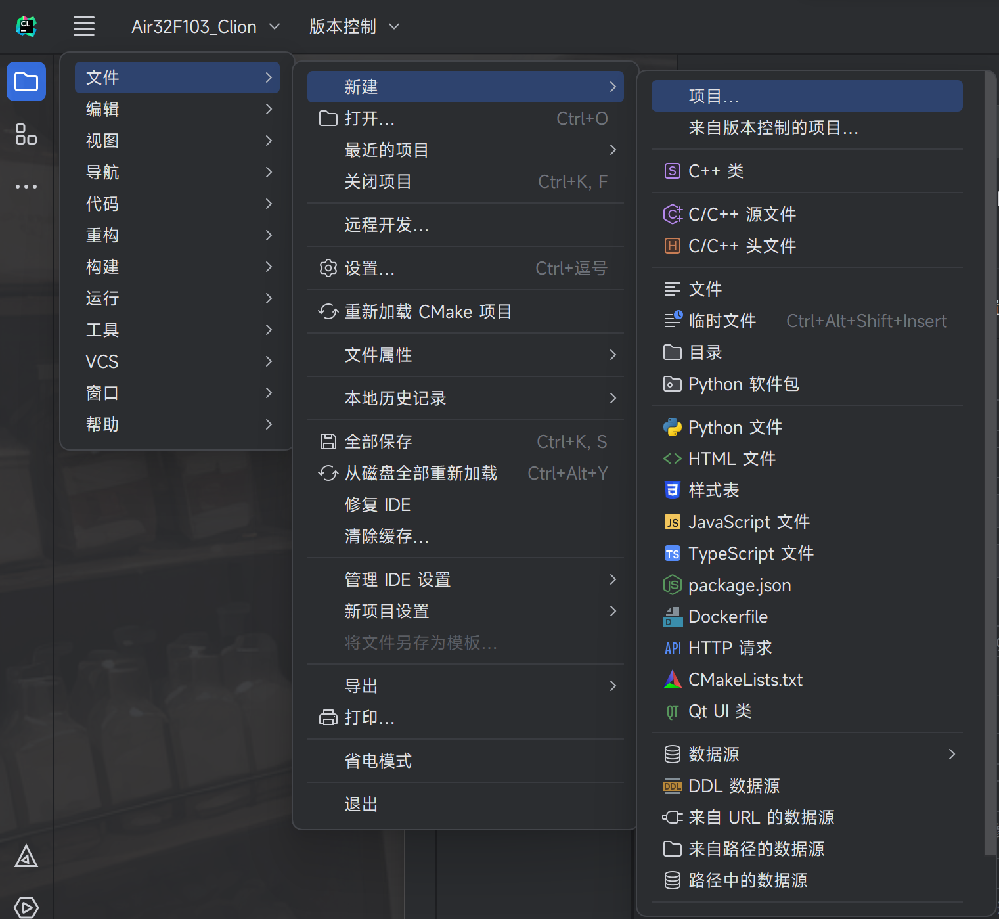
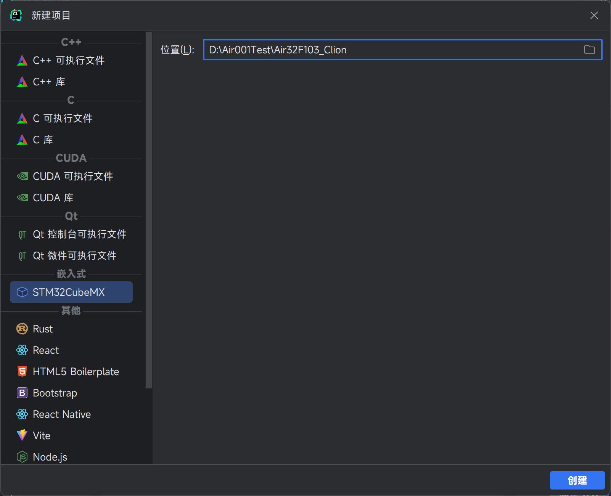
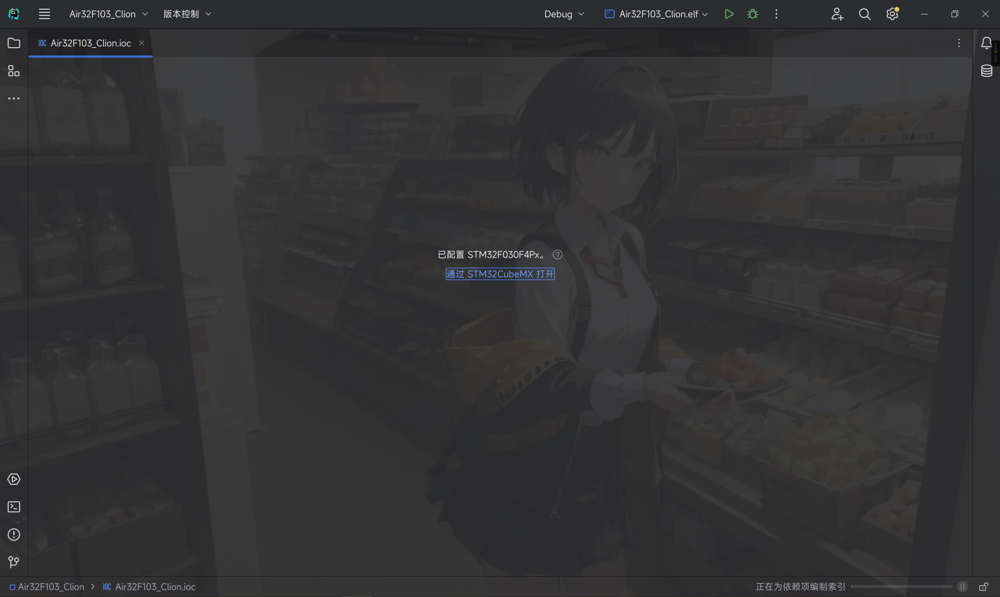
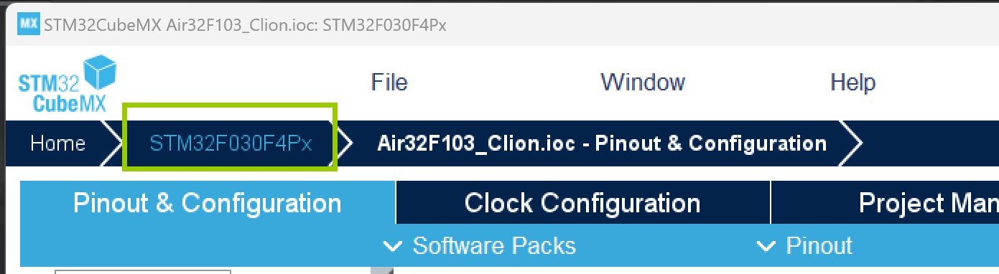
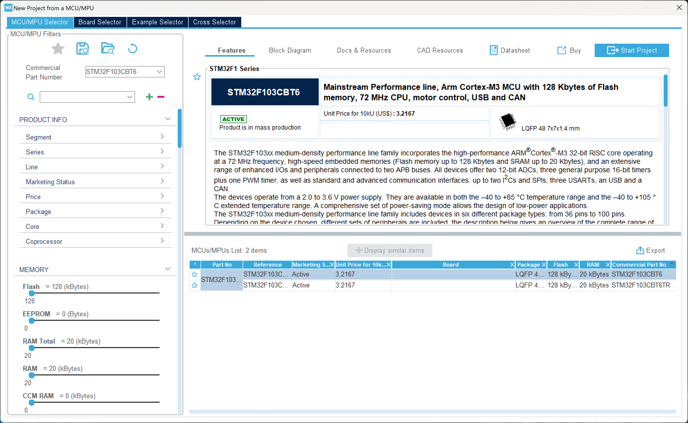
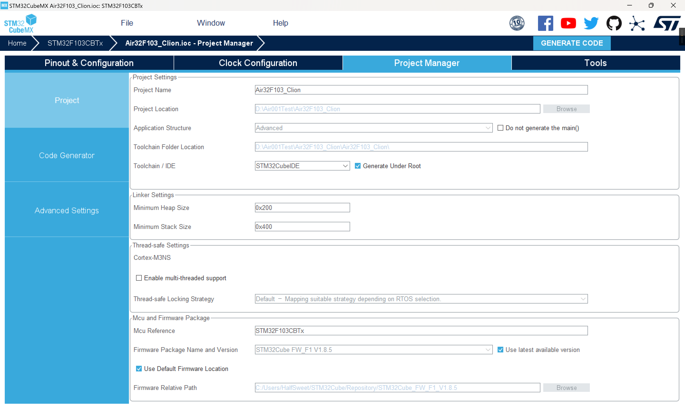
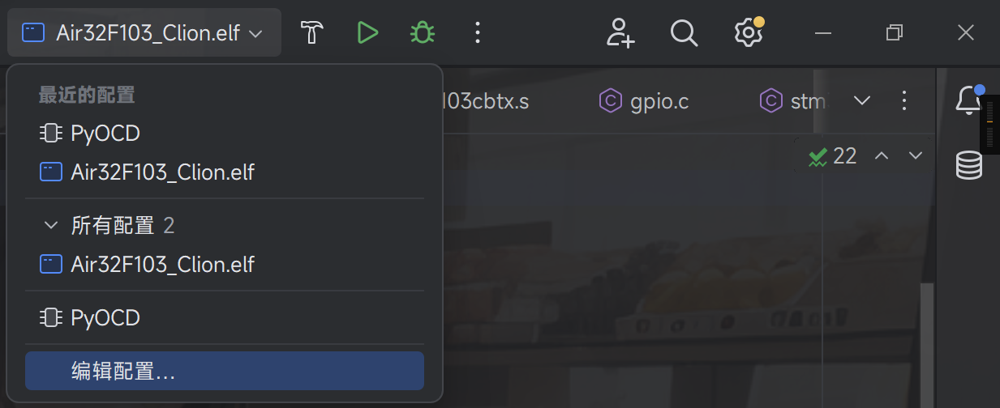
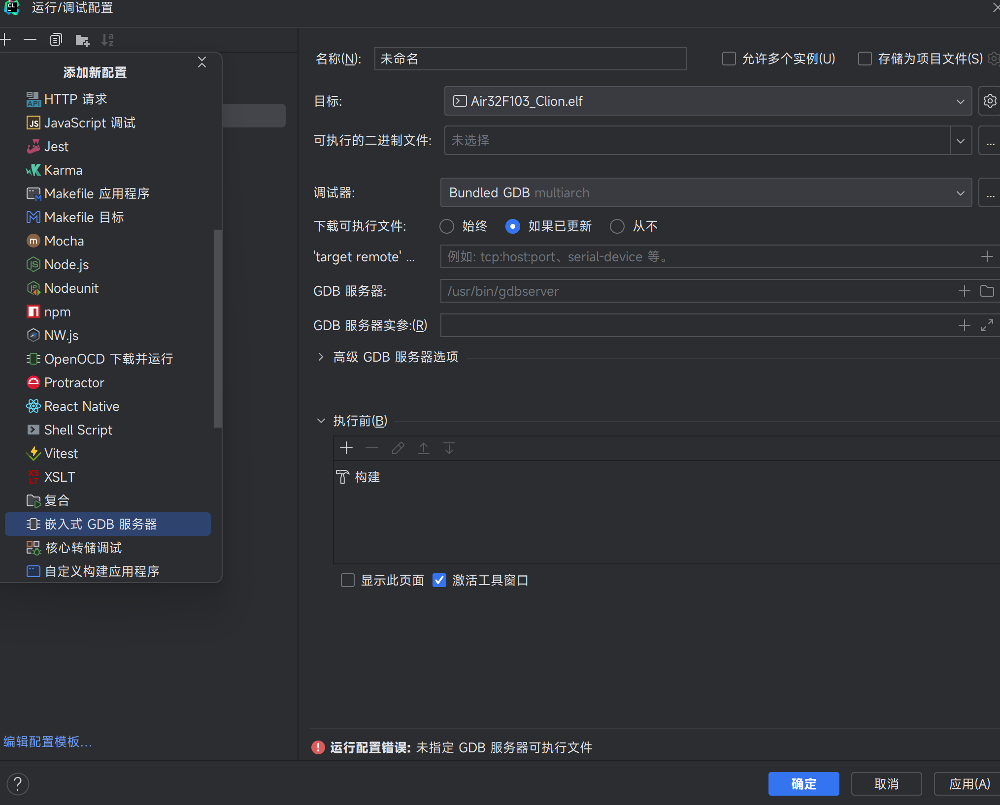
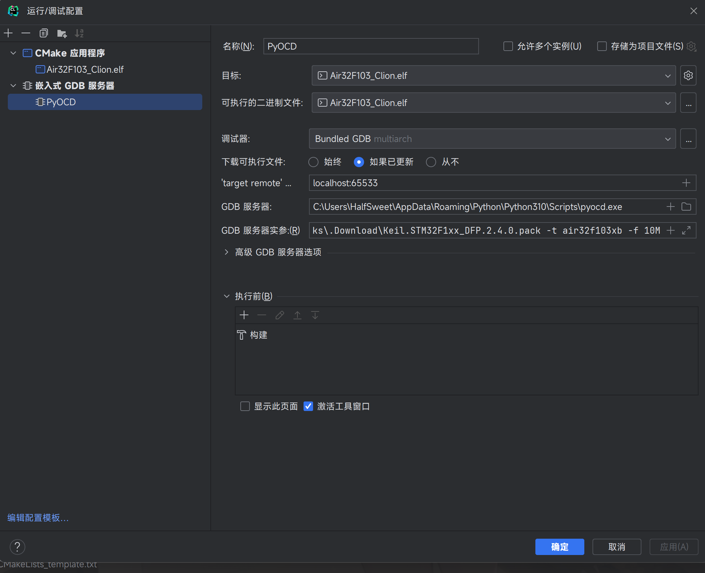

在上几篇文章中，我们将 HAL 库移植给了 Air32，但是我们的开发环境还是使用的 Keil，这样就会导致一些问题，比如 Keil 的代码提示不够友好，而且 Keil 的代码补全也不够完善，因此我们可以使用一个更好的开发环境，比如 Clion。

<!-- more -->

::: note
本文如没有特殊说明，均以 Clion 的新 UI 为例
:::

## 前置条件

1. 需要 Clio 你软件（废话
2. 需要安装`arm-none-eabi-gcc`，windows 用户建议通过`MSYS2`的包管理工具安装，在此不多赘述
3. 我们推荐使用`PyOCD`作为调试器
4. 安装`STM32CubeMX`生成工程模板，当然这一步不是必须的，你也可以用我们文末提供的模板

:::tip
MinGW 和 Cmake 工具链目前最新版的 Clion 自带，我们无需在意
:::

## 新建工程

打开 Clion 软件，点击左上角的`☰-文件-新建-项目`按钮



选择左边`嵌入式`列表中的`STM32CubeMX`，路径自定



选择`在 STM32CubeMX 中打开`



默认采用了`STM32F030F4Px`，点击顶上面包屑导航的`STM32F030F4P6`修改为`STM32F103CBTx`





点击`Start Project`，进入配置界面

接下来是常规配置，可以参考 [发挥全部实力！Air32 在 HAL 库环境下运行最高主频](./发挥全部实力！Air32 在 HAL 库环境下运行最高主频。md) 中的配置，这里不再赘述

## 生成代码

生成代码的时候，在`Project Manage`中的`Toolchain / IDE`中选择`STM32CubeIDE`，注意检查路径是否正确



点击右上角的`Generate Code`按钮，等待生成完成

## 生成 Cmake 工程

回到 Clion 中，打开`.ioc`目录下的工程，会自动生成 Cmake 工程，我们点击一下`构建`按钮，此时应该可以自动编译完成。

:::tip
记得安装`arm-none-eabi-gcc`环境
:::

## 下载工程

我们使用`pyOCD`下载，首先我们需要安装`pyOCD`的环境，这里我们选择安装`develop`版本，因为目前内置 Air32 的版本还没正式发布。

在我们有 Python 环境的前提下，只需要

```bash
pip install --pre -U git+https://github.com/pyocd/pyOCD.git@develop
```

即可安装。

接下来我们需要配置运行参数，我们点击上方的`运行/调试配置`按钮，然后点击`编辑配置`。



可执行文件中，修改为`pyOCD`的路径，如果找不到可以用`which pyocd`命令查看。

命令实参中，加入

```bash
flash --erase chip --target air32f103xb $CMakeCurrentBuildDir$/Air32F103_Clion.hex
```

芯片型号和具体的 hex 文件可以根据实际情况进行修改。

此时点击`运行`按钮，即可下载程序到 Air32 中。

## 配置调试器

点击`运行/调试配置`按钮，然后点击`编辑配置`，点击弹出窗口的左上角的`+`按钮，选择`嵌入式 GDB 调试器`



`target remote`中填入`localhost:65533`，或者端口自定，不冲突即可。

`GDB 服务器`中填入 pyOCD 的可执行文件路径

`GDB 服务器实参`中填入`gdbserver -p 65533 -t air32f103xb -f 10M`，端口号和芯片型号自定，如果连不上可适当降低频率。



最后点击确认即可

把运行配置切换到刚才设置的调试选项卡中，点击`调试`按钮即可进行调试

## 附录

此工程开源在<https://github.com/Air-duino/Air32-Clion-Template>上
