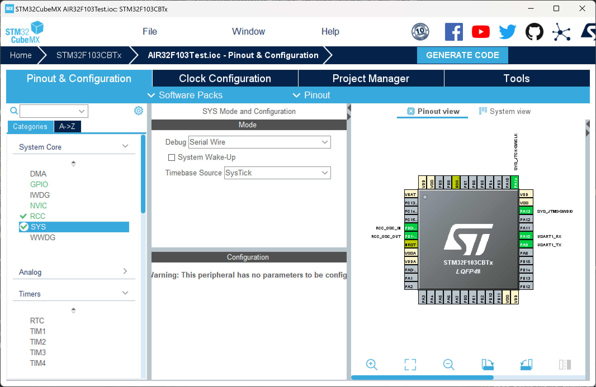
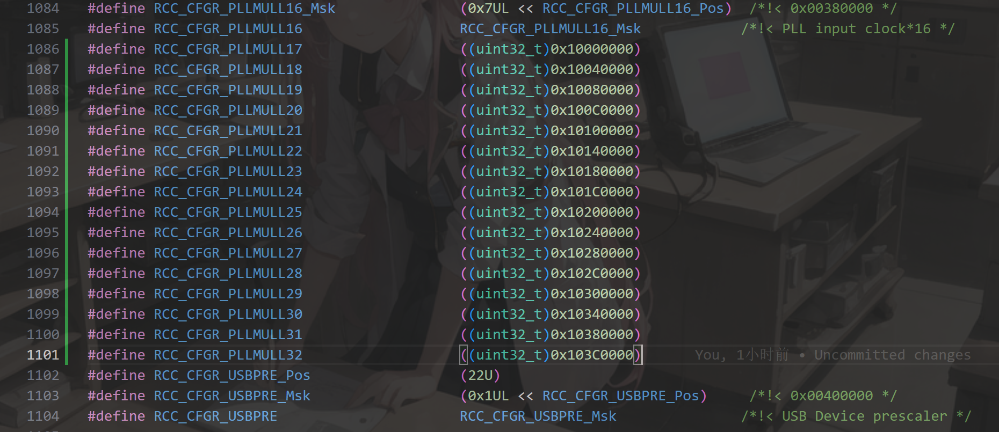
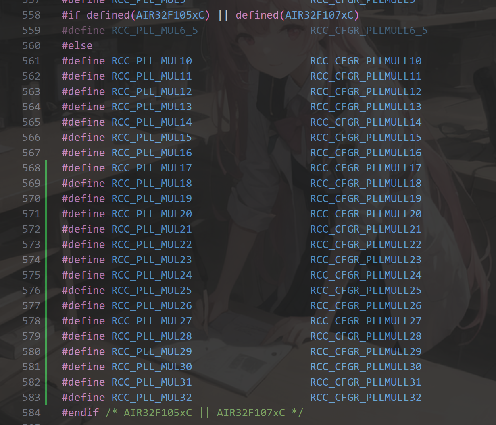
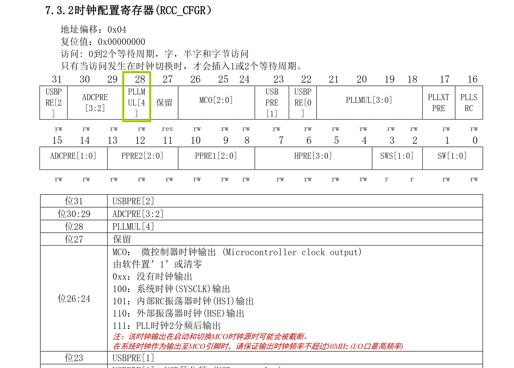
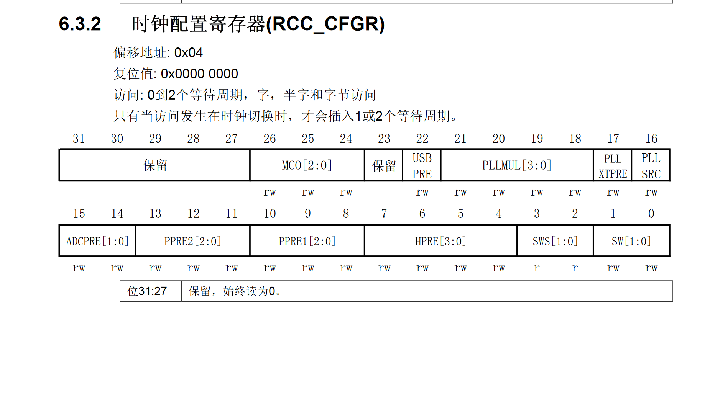
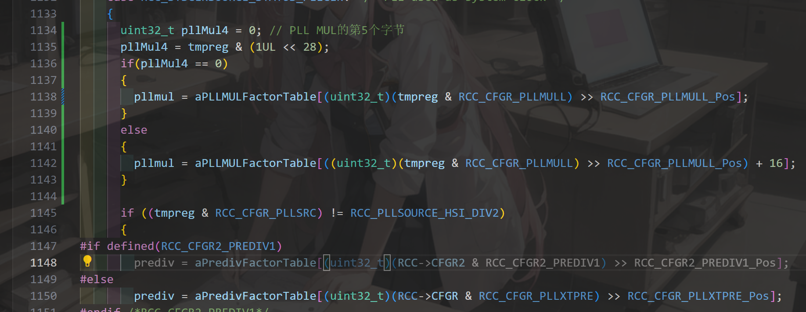
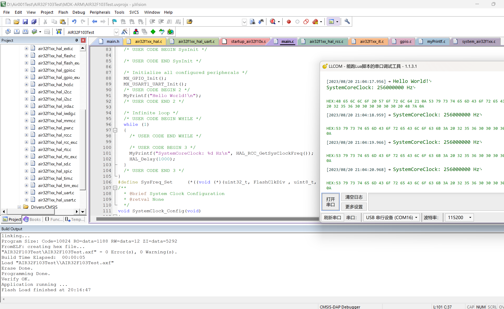

最近打算把 Air32 也吃上 Arduino，发挥全部性能，就不用像是 Air001 那样束手束脚了，但是问题是 Arduino 的库是基于 HAL 的，那要用上 Arduino 就必定得先适配 HAL 库，那我们就来先尝试在 HAL 下让 Air32 跑到最高主频吧。

<!-- more -->

## 初始化工程

首先我们需要先初始化一个工程，就单纯点灯和和串口打印，这里我偷懒用了`STM32CubeMX`，我们勾上串口和外部时钟，为了方便我们顺便把 SWD 也选上。大概就是这样



然后生成代码即可。

## 修改时钟

因为我们要跑高主频，原先的 PLL 倍频数不满足，用到了新的一些配置，因此我们需要修改芯片头文件以及`hal_rcc_ex.h`中的一些宏定义，首先是芯片的头文件，我们这里以`air32f103xb.h`为例，我们需要修改的地方如下

```c
#define RCC_CFGR_PLLMULL16_Pos               (19U)                             
#define RCC_CFGR_PLLMULL16_Msk               (0x7UL << RCC_CFGR_PLLMULL16_Pos)  /*!< 0x00380000 */
#define RCC_CFGR_PLLMULL16                   RCC_CFGR_PLLMULL16_Msk            /*!< PLL input clock*16 */
#define RCC_CFGR_PLLMULL17                   ((uint32_t)0x10000000)
#define RCC_CFGR_PLLMULL18                   ((uint32_t)0x10040000)
#define RCC_CFGR_PLLMULL19                   ((uint32_t)0x10080000)
#define RCC_CFGR_PLLMULL20                   ((uint32_t)0x100C0000)
#define RCC_CFGR_PLLMULL21                   ((uint32_t)0x10100000)
#define RCC_CFGR_PLLMULL22                   ((uint32_t)0x10140000)
#define RCC_CFGR_PLLMULL23                   ((uint32_t)0x10180000)
#define RCC_CFGR_PLLMULL24                   ((uint32_t)0x101C0000)
#define RCC_CFGR_PLLMULL25                   ((uint32_t)0x10200000)
#define RCC_CFGR_PLLMULL26                   ((uint32_t)0x10240000)
#define RCC_CFGR_PLLMULL27                   ((uint32_t)0x10280000)
#define RCC_CFGR_PLLMULL28                   ((uint32_t)0x102C0000)
#define RCC_CFGR_PLLMULL29                   ((uint32_t)0x10300000)
#define RCC_CFGR_PLLMULL30                   ((uint32_t)0x10340000)
#define RCC_CFGR_PLLMULL31                   ((uint32_t)0x10380000)
#define RCC_CFGR_PLLMULL32                   ((uint32_t)0x103C0000)
```



然后是`air32f1xx_hal_rcc_ex.h`，我们需要修改的地方如下

```c
#define RCC_PLL_MUL17                   RCC_CFGR_PLLMULL17
#define RCC_PLL_MUL18                   RCC_CFGR_PLLMULL18
#define RCC_PLL_MUL19                   RCC_CFGR_PLLMULL19
#define RCC_PLL_MUL20                   RCC_CFGR_PLLMULL20
#define RCC_PLL_MUL21                   RCC_CFGR_PLLMULL21
#define RCC_PLL_MUL22                   RCC_CFGR_PLLMULL22
#define RCC_PLL_MUL23                   RCC_CFGR_PLLMULL23
#define RCC_PLL_MUL24                   RCC_CFGR_PLLMULL24
#define RCC_PLL_MUL25                   RCC_CFGR_PLLMULL25
#define RCC_PLL_MUL26                   RCC_CFGR_PLLMULL26
#define RCC_PLL_MUL27                   RCC_CFGR_PLLMULL27
#define RCC_PLL_MUL28                   RCC_CFGR_PLLMULL28
#define RCC_PLL_MUL29                   RCC_CFGR_PLLMULL29
#define RCC_PLL_MUL30                   RCC_CFGR_PLLMULL30
#define RCC_PLL_MUL31                   RCC_CFGR_PLLMULL31
#define RCC_PLL_MUL32                   RCC_CFGR_PLLMULL32
```



然后修改`main.c`中的`SystemClock_Config`函数，把 PLL 的倍频修改为`RCC_PLL_MUL32`，这样就可以跑到 256M 了。

```c
  RCC_OscInitTypeDef RCC_OscInitStruct = {0};
  RCC_ClkInitTypeDef RCC_ClkInitStruct = {0};
  /** Initializes the RCC Oscillators according to the specified parameters
  * in the RCC_OscInitTypeDef structure.
  */
  RCC_OscInitStruct.OscillatorType = RCC_OSCILLATORTYPE_HSE;
  RCC_OscInitStruct.HSEState = RCC_HSE_ON;
  RCC_OscInitStruct.HSEPredivValue = RCC_HSE_PREDIV_DIV1;
  RCC_OscInitStruct.HSIState = RCC_HSI_ON;
  RCC_OscInitStruct.PLL.PLLState = RCC_PLL_ON;
  RCC_OscInitStruct.PLL.PLLSource = RCC_PLLSOURCE_HSE;
  RCC_OscInitStruct.PLL.PLLMUL = RCC_PLL_MUL32;
  if (HAL_RCC_OscConfig(&RCC_OscInitStruct) != HAL_OK)
  {
    Error_Handler();
  }

  /** Initializes the CPU, AHB and APB buses clocks
  */
  RCC_ClkInitStruct.ClockType = RCC_CLOCKTYPE_HCLK|RCC_CLOCKTYPE_SYSCLK
                              |RCC_CLOCKTYPE_PCLK1|RCC_CLOCKTYPE_PCLK2;
  RCC_ClkInitStruct.SYSCLKSource = RCC_SYSCLKSOURCE_PLLCLK;
  RCC_ClkInitStruct.AHBCLKDivider = RCC_SYSCLK_DIV1;
  RCC_ClkInitStruct.APB1CLKDivider = RCC_HCLK_DIV2;
  RCC_ClkInitStruct.APB2CLKDivider = RCC_HCLK_DIV1;

  if (HAL_RCC_ClockConfig(&RCC_ClkInitStruct, FLASH_LATENCY_2) != HAL_OK)
  {
    Error_Handler();
  }
```

但是事情远没有那么简单，Air32 作为典型的国产 MCU，那必然是存在很多暗坑，我们查看提供的标准库的 RCC 例程，发现需要进行一个“解锁”操作。那我们依葫芦画瓢，在`air32f1xx_hal_rcc.c`中的`HAL_RCC_OscConfig`函数中 728 行左右添加这么几段：

```c
          /* Set PREDIV1 Value */
          RCC->CFGR = (RCC->CFGR & ~0x00030000);
          __HAL_RCC_HSE_PREDIV_CONFIG(RCC_OscInitStruct->HSEPredivValue);
        }

        /* Configure the main PLL clock source and multiplication factors. */
        /* __HAL_RCC_PLL_CONFIG(RCC_OscInitStruct->PLL.PLLSource,
                             RCC_OscInitStruct->PLL.PLLMUL); */
        *(volatile uint32_t *)(0x400210F0) = 1;//开启 sys_cfg 门控
	    *(volatile uint32_t *)(0x40016C00) = 0xa7d93a86;//解一、二、三级锁
	    *(volatile uint32_t *)(0x40016C00) = 0xab12dfcd;
	    *(volatile uint32_t *)(0x40016C00) = 0xcded3526;
	    *(volatile uint32_t *)(0x4002228C) = 0xa5a5a5a5;//QSPI 解锁

        // 默认 Flash 读取等待时间为 2 个 CPU 周期
        AIR32F1_SysFreq_Set(RCC_OscInitStruct->PLL.PLLMUL,FLASH_Div_2 ,0,1);

        RCC->CFGR |= RCC_OscInitStruct->PLL.PLLSource;

        //恢复配置前状态
        *(volatile uint32_t *)(0x400210F0) = 0;//开启 sys_cfg 门控
        *(volatile uint32_t *)(0x40016C00) = ~0xa7d93a86;//加一、二、三级锁
        *(volatile uint32_t *)(0x40016C00) = ~0xab12dfcd;
        *(volatile uint32_t *)(0x40016C00) = ~0xcded3526;
        *(volatile uint32_t *)(0x4002228C) = ~0xa5a5a5a5;//QSPI 解锁

        /* Enable the main PLL. */
        __HAL_RCC_PLL_ENABLE();
```

需要注意的是，`AIR32F1_SysFreq_Set`是一个自定义的宏，其原型是

```c
typedef void (*AIR32F1_SysFreq_Set_FuncPtr)(uint32_t, FlashClkDiv, uint8_t, uint8_t);
#define AIR32F1_SysFreq_Set (*((AIR32F1_SysFreq_Set_FuncPtr)(*(uint32_t *)0x1FFFD00C)))
```

其中的`FlashClkDiv`类型是

```c
typedef enum 
{
	FLASH_Div_0 = 0,
	FLASH_Div_2 = 1,
	FLASH_Div_4 = 2,
	FLASH_Div_6 = 3,
	FLASH_Div_8 = 4,
	FLASH_Div_16 = 5,
}FlashClkDiv;
```

这俩随便放在哪都好，我就放到了`air32f1xx_hal_rcc_ex.h`中了。

需要注意的是，`AIR32F1_SysFreq_Set`这个函数本身就很魔法…其实现是固化在了芯片中，我们将`0x1FFFD00C`这个地址强转为函数指针，然后再传入，以及那些奇奇怪怪的地址都是直接写的手册上没有的寄存器地址，至于具体是什么，我也希腊奶，反正就是这么用的。

## 修改`HAL_RCC_GetSysClockFreq`

现在我们可以成功拉高主频了，但是 HAL 库内部用的`HAL_RCC_GetSysClockFreq`函数来获取主频，如果主频不对那其它外设的分频也会出问题，最典型的就是串口输出乱码。

我们查看 Air32 的参考手册，发现与 STM32 相比，其 PLL 的倍频寄存器是 5 个 bit，比 STM32 多一个 bit，但是很难受的是多的那个 bit 是在高位且和其它的不连续。





因此我们需要单独判断这个 bit，如果为 0 的情况下和 STM32 的行为一致，如果为 1 的情况下，我们需要手动转换一下。

首先我们修改`aPLLMULFactorTable`数组，把缺失的几个倍频值补上。

```c
#if defined(RCC_CFGR2_PREDIV1SRC)
  const uint8_t aPLLMULFactorTable[14] = {0, 0, 4, 5, 6, 7, 8, 9, 0, 0, 0, 0, 0, 13};
  const uint8_t aPredivFactorTable[16] = {1, 2, 3, 4, 5, 6, 7, 8, 9, 10, 11, 12, 13, 14, 15, 16};
#else
  const uint8_t aPLLMULFactorTable[] = {2, 3, 4, 5, 6, 7, 8, 9, 10, 11, 12, 13, 14, 15, 16, 16, 17, 18, 19,
  20, 21, 22, 23, 24, 25, 26, 27, 28, 29, 30, 31, 32};
#if defined(RCC_CFGR2_PREDIV1)
  const uint8_t aPredivFactorTable[16] = {1, 2, 3, 4, 5, 6, 7, 8, 9, 10, 11, 12, 13, 14, 15, 16};
#else
  const uint8_t aPredivFactorTable[2] = {1, 2};
#endif /*RCC_CFGR2_PREDIV1*/

#endif
```

然后我们稍微修改下计算倍频的代码，在大约 1134 行的地方修改为

```c
    case RCC_SYSCLKSOURCE_STATUS_PLLCLK:  /* PLL used as system clock */
    {
      uint32_t pllMul4 = 0; // PLL MUL 的第 5 个字节
      pllMul4 = tmpreg & (1UL << 28);
      if(pllMul4 == 0)
      {
        pllmul = aPLLMULFactorTable[(uint32_t)(tmpreg & RCC_CFGR_PLLMULL) >> RCC_CFGR_PLLMULL_Pos];
      }
      else
      {
        pllmul = aPLLMULFactorTable[((uint32_t)(tmpreg & RCC_CFGR_PLLMULL) >> RCC_CFGR_PLLMULL_Pos) + 16];
      }
      
```



## 修改串口分频定义宏

此时理论上来说已经可以正常工作，但是我们会发现串口输出还是乱码，这是因为 HAL 库中串口的分频计算可能会溢出。我们打开`air32f1xx_hal_uart.h`中的第 839 行，把原来的

```c
#define UART_DIV_SAMPLING16(_PCLK_, _BAUD_)            (((_PCLK_)*25U)/(4U*(_BAUD_)))
```

修改为

```c
#define UART_DIV_SAMPLING16(_PCLK_, _BAUD_)            ((_PCLK_)/(4U*(_BAUD_))*25U)
```

至此，HAL 库需要修改的内容已经完成。

## 添加 Printf 输出

为了避免原生的 Printf 问题，我们自己定义一个`MyPrintf`函数，其定义如下：

```c
int MyPrintf(const char* format, ...)
{
    int ret;
    char buffer[256];
    va_list args;
    va_start(args, format);
    ret = vsnprintf(buffer, sizeof(buffer), format, args);
    va_end(args);
    HAL_UART_Transmit(&huart1, (uint8_t*)buffer, ret, 1000);
    return ret;
}
```

最后，我们在主函数中添加输出主频的相关代码：

```c
int main(void)
{
  /* USER CODE BEGIN 1 */

  /* USER CODE END 1 */

  /* MCU Configuration--------------------------------------------------------*/

  /* Reset of all peripherals, Initializes the Flash interface and the Systick. */
  HAL_Init();

  /* USER CODE BEGIN Init */

  /* USER CODE END Init */

  /* Configure the system clock */
  SystemClock_Config();

  /* USER CODE BEGIN SysInit */

  /* USER CODE END SysInit */

  /* Initialize all configured peripherals */
  MX_GPIO_Init();
  MX_USART1_UART_Init();
  /* USER CODE BEGIN 2 */
  MyPrintf("Hello World!\n");
  /* USER CODE END 2 */

  /* Infinite loop */
  /* USER CODE BEGIN WHILE */
  while (1)
  {
    /* USER CODE END WHILE */

    /* USER CODE BEGIN 3 */
    MyPrintf("SystemCoreClock: %d Hz\n", HAL_RCC_GetSysClockFreq());
    HAL_Delay(1000);
  }
  /* USER CODE END 3 */
}
```

编译下载，打开串口调试助手，可以观察到：



串口输出无乱码，主频正确，我们已经成功在 HAL 中跑到了最高主频。

## 附录

本文的工程开源在<>，用到的 HAL 库源码在<>。
