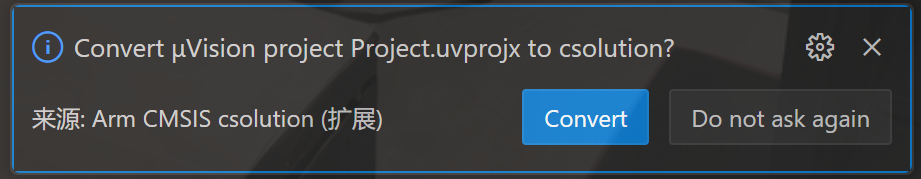
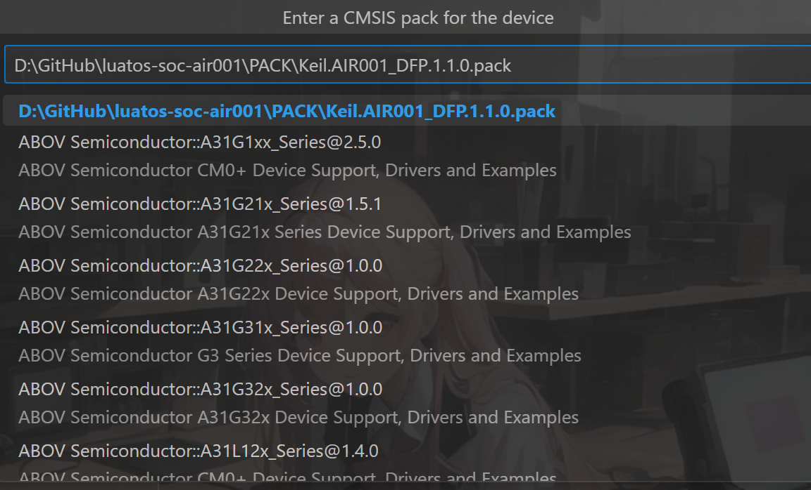

今日，在千呼万唤中，Arm 的 MDK6 桌面端终于出来了，本想作为第一批吃螃蟹的开发者，但是当时 Air32 和 Air001 的烧录均有问题，最后在 Arm 官方的支持下，终于可以正常使用了，那么现在我们就来尝试一下。
<!-- more -->

## 安装 MDK6

MDK6 实际上是 VSCode 的一个插件，这看起来很荒谬，实际上也确实很荒谬。所以首先我们需要安装 VSCode，这里不多赘述。

安装完成后，我们打开插件的主页<https://marketplace.visualstudio.com/items?itemName=Arm.keil-studio-pack>，点击`install`，即可跳转到 VSCode 中自动安装。这个过程中会安装一大堆依赖的奇奇怪怪的很多插件，甚至可能有 AC6 编译器，请耐心等待。

## 转换工程

因为目前 MDK6 的工程创建还很辣鸡，因此我们选择把原来 MDK5 的工程转换过来，这里我们以 Air001 为例。

我们随便找一个例子，我们这里以 GPIO 下的`GPIO_Toggle`为例，首先我们先复制粘贴一份，然后重命名为`GPIO_Toggle_MDK6`。打开其中的`MDK-ARM`文件夹，然后选择在 VSCode 中打开。

这是我们会发现出现了一个`Convert μVision project Project.uvprojx to csolution?`的弹窗，点击`convert`即可。

此时会自动转换，稍等即可。

::: note
目前仅支持转换 AC6 的工程，如果是 AC5 编译器的工程需要自行修改
:::

## 编译工程

点击左边的`CMSIS`按钮，点击`action`列表中的`build`即可开始编译。

## 烧录程序

首先我们插入调试器，然后点击左边的`Device Manage`按钮，然后点击`Add device`，然后选择实际使用的调试器，我这里使用的是 ST-Link。然后点击左边列表中的铅笔图标，也就是`Edit Device`

1. 修改名称，可以修改成自己喜欢的，此处我们保存默认，直接按`Enter`键即可
2. 选择 pack 包，我们输入本地最新的 pack 包路径，我这里为`D:\GitHub\luatos-soc-air001\PACK\Keil.AIR001_DFP.1.1.0.pack`

3. 选择芯片，我们这里选择`AIR001Dev`即可

点击左边的`CMSIS`按钮，点击`action`列表中的`RUN`按钮即可下载。

::: tip
目前 MDK6 还不能修改调试器的速度，因此默认的 10M 对于 Air001 来说太高了，建议使用别的调试器进行烧录。

如果出现`ERROR: Cannot attain state requested. (RDDI-ERROR 52)`这样的报错，就是说明速率太高无法下载。
:::

::: note
默认下载完不会自动复位，我们可能需要手动按一下 RST 按钮
:::

至此，我们就完成了一个简单的工程的编译与烧录。
