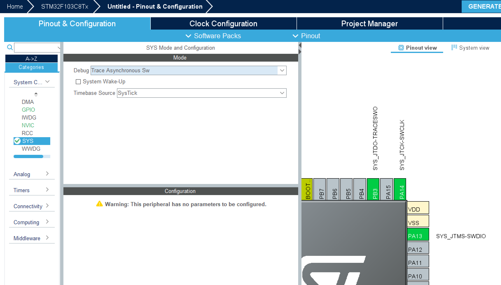
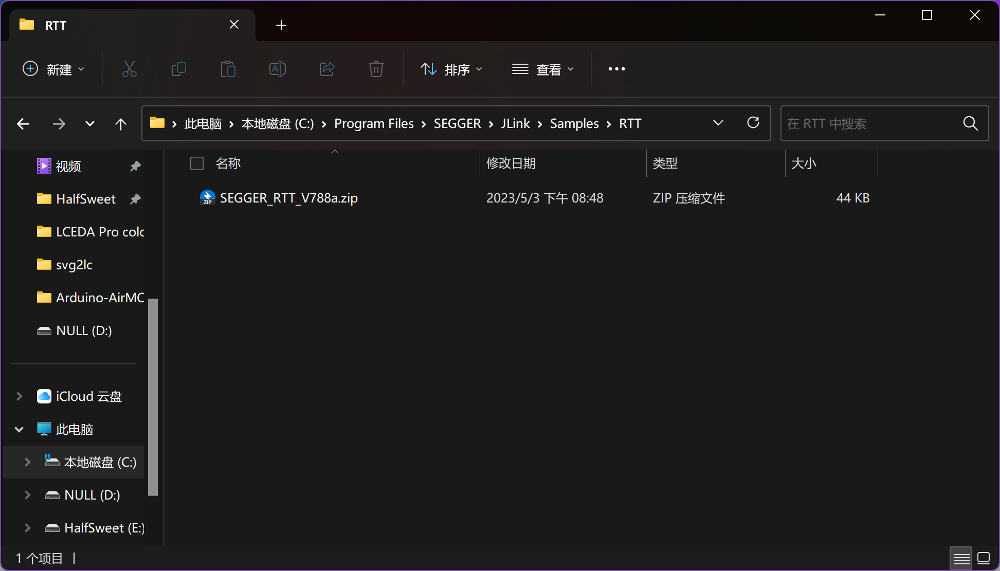
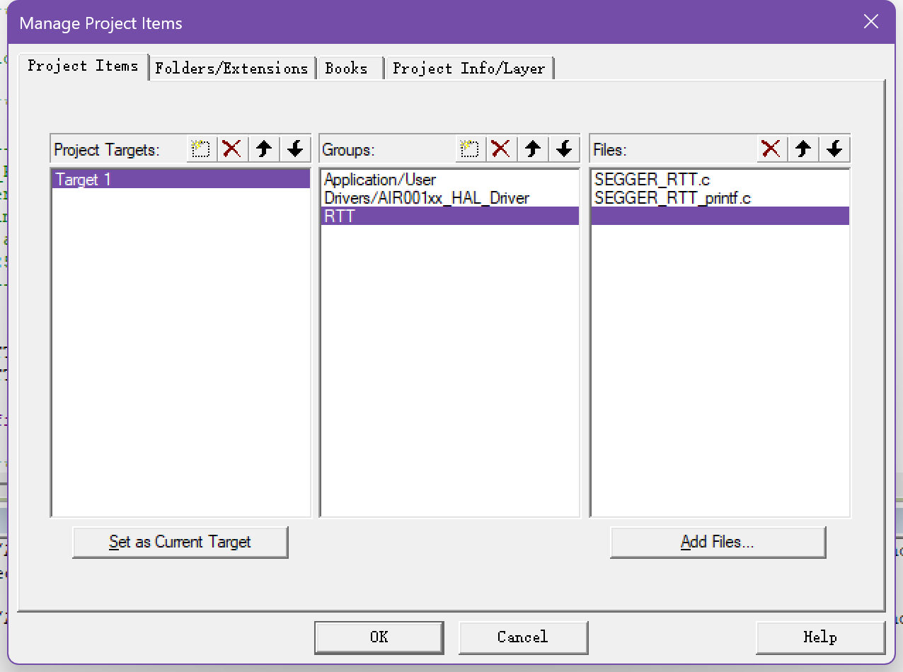
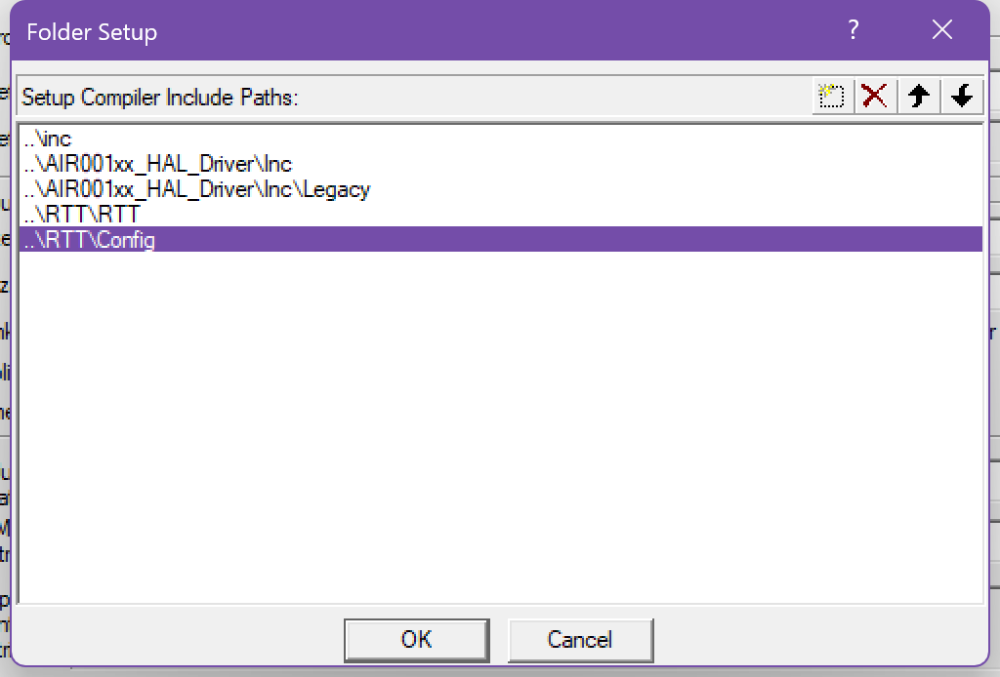
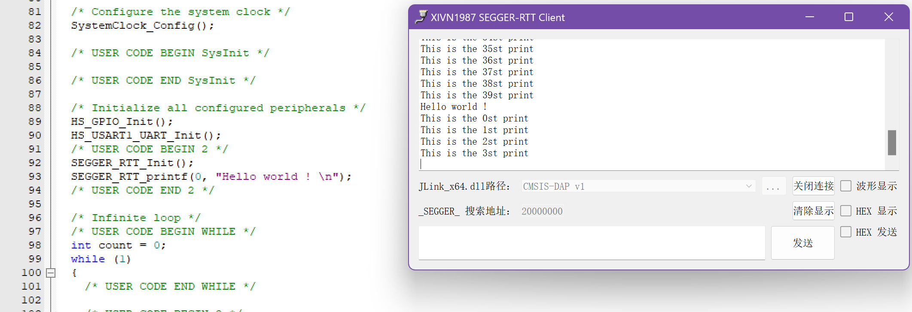

在日常的开发中，我们免不了使用各种各样的日志打印方式，使用调试器固然好用，但是无法直接打印局部变量以及会打断整个运行状态。并且对于众多`Arduino`的用户来说，直接打印日志显然是更直观的做法。但是直接使用串口打印的话需要一定的资源，并且速度会稍慢，并且可能会占用一个串口，对于资源就不多的MCU，我们有没有更方便的方法呢？
<!-- more -->
## 调试方式
### 使用SWO
对于这个问题，众多厂商也有着相同的需求，于是Arm公司便提出了一种叫做`Serial Wire Output`的协议，我们将其简称为`SWO`。简单来说，它是一种用于调试的接口协议。SWO是在ARM Cortex-M微控制器上实现的，它允许调试器通过单个引脚输出数据，而不需要占用其他引脚。使用SWO接口，可以在运行时输出调试信息，例如程序状态、变量值、函数返回值等，从而帮助开发人员进行调试。

在`STM32`微处理器的编程中，我们只需要在`STM32CubeMX`软件中打开异步跟踪模式即可使用SWO进行输出调试，相比与串口的打印，使用SWO明显效率更高，占用的引脚更少。

但是遗憾的是，采用SWO的日志输出依然会占用一个IO，并且只能和SWD/JTAG等调试口联用。那么我们有没有一种方法，可以做到只使用调试接口就可以输出日志，并且拥有相似甚至更高的效率呢？

### SEGGER-RTT
在此基础上，伟大的`SEGGER Microcontroller`公司便推出了一种新的日志打印方式，称之为`Real-Time Transfer`，也就是简称的`RTT`。什么？你没听过这个公司？那你总用过`J-Link`吧，是的，它们出自于一家公司。

SEGGER-RTT 的原理是通过在目标设备上的专用软件库，将实时数据通过 JTAG/SWD 接口传输到 Host 端。这个过程中不需要额外的硬件支持，只需要使用 SEGGER 的调试器和它的支持的 IDE（如SEGGER's Embedded Studio或其他兼容IDE）。SEGGER-RTT 通过利用调试器的访问权限，从调试目标设备的内部缓冲区中读取数据，并将这些数据发送到 Host 端进行处理和显示。同时也可以在 Host 端向目标设备发送数据，以便执行一些控制操作或者更改程序的状态。由于 SEGGER-RTT 可以非常快速地传输大量数据，因此它通常被用于实时性要求较高的应用程序中。

## 移植SEGGER-RTT
我们来尝试在Air001单片机上移植SEGGER-RTT。移植好的工程开源链接：

<https://github.com/Air-duino/Air001-SEGGER-RTT-Keil>

### 0x01 安装J-Link
第一步，我们先下载一个[Jlink全家桶](https://www.segger.com/downloads/jlink/#J-LinkSoftwareAndDocumentationPack)，然后安装。
然后在如图所示的安装目录下，我们应该可以看到这样的一个压缩文件：

解压它，备用。

### 0x02 加入Keil工程
我们将`xxx/JLink\Samples\RTT\SEGGER_RTT_V788a\`下的`RTT`和`Config`文件夹复制到我们的工程目录下，并加入到Keil工程中，别忘了添加头文件。



### 0x03 初始化并调用
在`main.c`文件中include头文件，并初始化。
```c
int main(void)
{
  HAL_Init();
  SystemClock_Config();
  HS_GPIO_Init();
  HS_USART1_UART_Init();
  SEGGER_RTT_Init();
  SEGGER_RTT_printf(0, "Hello world ! \n");
  int count = 0;
  while (1)
  {
    SEGGER_RTT_printf(0, "This is the %dst print \n", count);
    count++;
    HAL_Delay(1000);
  }
}
```
因为我们使用的是DAPLink，Jlink的软件无法识别，因此我们使用了一个第三方的软件：
<https://github.com/XIVN1987/RTTView>

打印出了预期的结果。

## 后记
* 思考：效率是否能进一步提高呢？